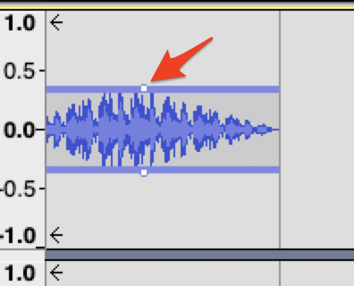

 
# Editing Audio Transitions, Voiceovers, & Free Audio Clips
Let’s add some music bumpers and voiceovers to your podcast audio. Many podcasts include music at the beginning and end, as well as during transitions. Music can also be added into the background of an interview as a pleasant effect or to mask noisy background sounds. If you have any questions or get stuck as you work through this in-class exercise, please ask the instructor for assistance.  Have fun!

1. Find music that fits your tone and sound effects that enhance your sense of location. There are many Creative Commons or royalty-free music websites that aggregate and distribute music that are shared with no or low copyright limitations including:
- [Free Music Archive](https://freemusicarchive.org/curator/Creative_Commons/){:target="_blank"}- CC-licensed music grouped by genre.
- [Free Sound](https://freesound.org/browse/){:target="_blank"} - A collaborative database of CC-licensed sound. Freesound focusses on sound and sound effects, not music. 
- [Archive.org](https://archive.org/details/opensource_audio){:target="_blank"} - Non-profit digital library with collections of digitized free movies, music, images, websites and more.
- [ccMixter](http://ccmixter.org/find-music){:target="_blank"} - CC-licensed music for film, video and games.
- [CCTrax](https://cctrax.com/){:target="_blank"} - CC-licensed music grouped by genre. 
 
2. **Download** a music file from **Free Music Archive** that will be an audio bumper or audio introduction to your podcast by going to the following web address, and clicking on the “down arrow” button beside a music track (please make a note of where you save the mp3 file): [http://bit.ly/2OgSUsS](https://freemusicarchive.org/curator/Creative_Commons/){:target="_blank"} 
- Import the audio file you just downloaded going to **File -> Import -> Audio** and then selecting the mp3 file from the file manager. 
- A new audio track with the music will appear in Audacity below your interview audio.

<button onclick="toggle('gif1')">Show / Hide Animation </button>

3. Create a music introduction and ending for your podcast: 
- First, listen to the music track, so you can find part of the track you want to use. 
- Delete all but the 8 seconds of music you want to use by **selecting the beginning of the music track** up to the point that you want to use and then press the **Delete** button on your keyboard. 
- **Select** all but 8 seconds of the music and press the **Delete** key on your keyboard. 
- You should now be left with 8 seconds of music.

<button onclick="toggle('gif2')">Show / Hide Animation </button>

4. Create 5 seconds of blank audio into the beginning of your voice track & fade intro music in & out:
- **Grab** the grey bar at the top of your **voice audio track** and **drag it to the right** about **6-seconds**. 
 
- Using the **Selection Tool** (see right) **Select the first 3-seconds** of the **music audio** (the background will turn white), and then on the top menu: **Effect -> Fade out**.
- **Select the last 4-seconds** of the music audio (the background will turn white), and then on the top menu: **Effect -> Fade in**.
- **Copy** and **paste** your music audio to **near the end of the music track** just before where the voice audio track ends (see below).

<button onclick="toggle('gif3')">Show / Hide Animation </button>

5. Lower the volume of the music intro and playout:  
- The music is a bit loud so let’s lower the overall volume by **clicking** on the **Envelope Tool** on the top menu (see right).
- **Select** the **music intro audio track**, then **grab** the **white handle** at the top of the audio wave and **drag it down** so that it looks something like the image to the right.
- Do the same for the music at the end of the audio track.

<button onclick="toggle('gif4')">Show / Hide Animation </button>

6. Add a music bridge to your podcast:
- First **find the region** you want to add a bridge. This could be between two topics in your podcasts, before introducing a new speaker, or when you need suspension, etc.
- Put your **cursor** on the region you want to add the bridge in between. **Right click**, and choose **split clip**. This would divide your main track into half.
- **Drag** the second part of your track until you make a **balnk gap** for the **duration of your bridge**. The duration of the bridge is up to you and could be different for every project, or even between bridges. Let's say you want this bridge to last 8 seconds.
- Now that you have a blank region for your bridge, lets add some media (e.g., music). First **add** your desired audio file to a **new track**. You can do this by **dragging and dropping** the MP3 (or any other format) file of your desired audio to audacity. This would create a new track **below your main track**.
- **Select** 8 seconds of your audio file that you want to put as your bridge:
  1. With your mouse, **select** your desired **8 seconds** of the audio file.
  2. **Right click** on the selected region and choose **split clip**. This would **detach** the selected region from the audio.
  3. **Delete** the **other parts** that you do not need.
- **Drag** the trimmed audio file and situate it exactly **below your gap**.
- With your maouse, **drag** the edges of your audio file one at a time, and **extend the edges** until your audio completely **covers the bridge**. The amount of **overlap** between your bridge audio and your main vocal track depends on you. Generally, a **longer overlaps** result in **smoother transitions**.
- Now its time for **fading in/out** your bridge audio:
  1. **Select** the **left side** of your audio up **until** the **left edge of the gap**, then on the top menu: **Effect -> Fading -> Fade in**.
  2. **Select** the **right side** of your audio **from** the **right edge of the gap**, then on the top menu: **Effect -> Fading -> Fade out**.

7. Let’s create and place some voice over audio in the middle of your podcast:
- Create a new audio track for a voice-over, by clicking on **Tracks -> Add New -> Mono Track**.   
- Using the **Selection Tool** (see right), **click** on your new track **to the right** of all of the voice and music audio that you have already recorded and edited (so that when you record your voice over audio you do not hear any of the audio you’ve already worked with).
- **Click** on the red **Record** button on the top menu to start recording your voice-over audio.
- **Select** and **delete** all of the blank space at the **beginning** and **end** of your voice-over audio in your new audio track.

<button onclick="toggle('gif5')">Show / Hide Animation </button>

- **Click** on the grey bar at the top of your audio track, and **drag your voice over audio** to the part of the interview where you would like to place it.
- To lower the volume on your primary podcast audio track in the same area where you have placed your voice-over audio, start by using the **selection tool** and **click** on the podcast voice track at the **beginning of where you want your voice over to start**. 
- Next in the menu, click **Edit -> Clip Boundaries -> Split**.
- **Click on your podcast audio track** approximately **where your voice over will end**. Next click **Edit -> Clip Boundaries -> Split**.

<button onclick="toggle('gif6')">Show / Hide Animation </button>

- **Click** on the **Envelope Tool** on the top menu (see right).  
- **Select** the **portion of the track you just isolated**, then **grab** the **white handle** at the top of the audio wave and **drag it down** to reduce the volume where your voice over will be.
- Play the audio to make sure that the voice over is in the right place and adjust as necessary.

<button onclick="toggle('gif7')">Show / Hide Animation </button>

7. Export the audio in High MP3 quality:
- Select on the top menu: **File -> Export -> Export as MP3** and then click the **Save** button.
- Edit the meta-data for your podcast (this is optional). Click **OK**.
- If you haven’t already installed the library to export MP3 files you will be prompted to download a free copy of “LAME” that will do this for you by pressing the Download button. Follow the installation directions for your operating system (ask for help if you have any problems).

[Based on the CC-licensed VCU podcasting guide](https://guides.library.vcu.edu/podcast/editing){:target="_blank"}

[Installing FFMPEG](ffmpeg.html){: .btn .btn-green }

[NEXT STEP: Recording Remote Interviews using Zoom](recording-remote-interviews.html){: .btn .btn-blue }
