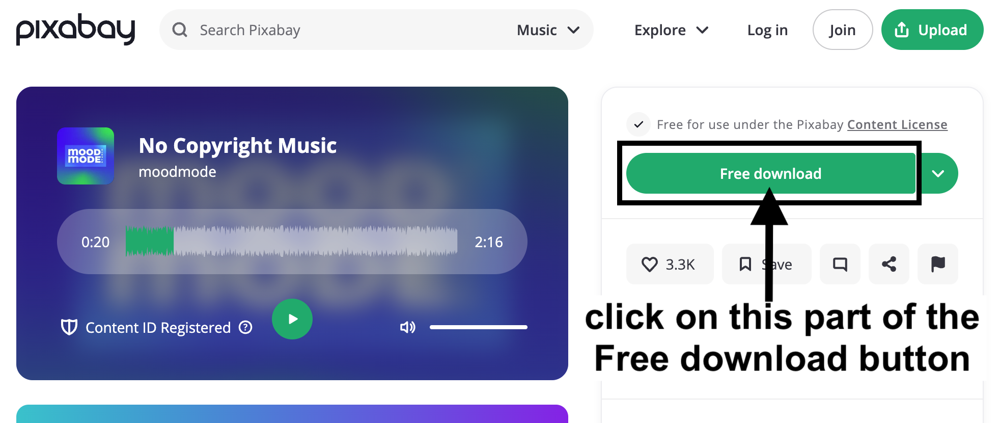
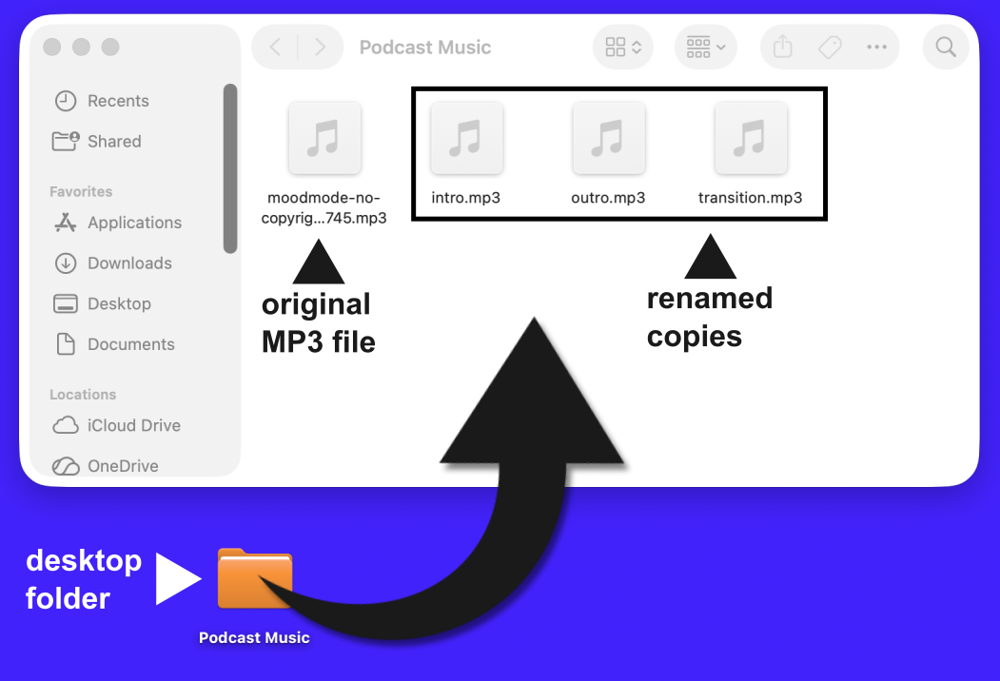
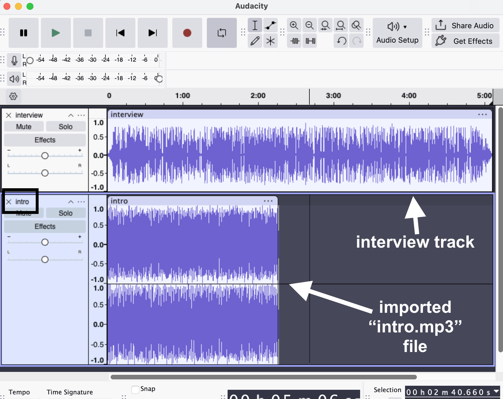
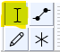
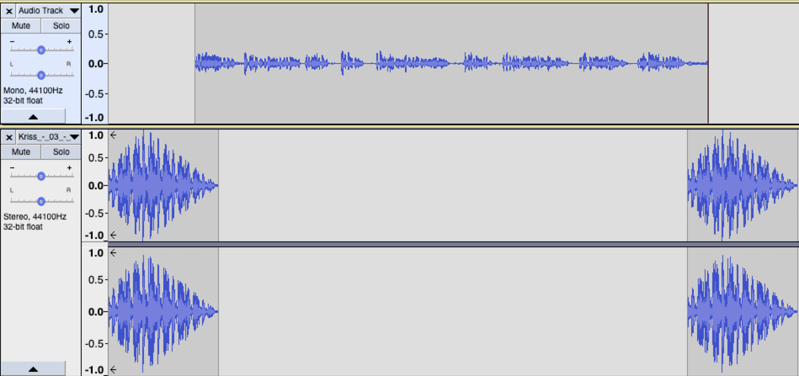
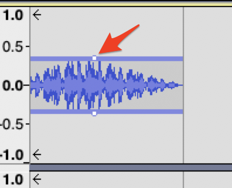
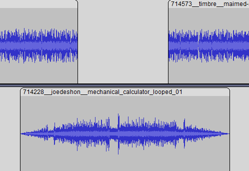

 
# Adding music to your podcast

Now that you have learned the basics of Audacity's recording, editing, and exporting process, as covered in [section 1](https://uviclibraries.github.io/podcasting/recording-audio.html) and [section 2](https://uviclibraries.github.io/podcasting/editing-audio.html), it is time to help your podcast sound a little more polished and dynamic. 

Many podcasts include music at the beginning and end of an episode, as well as during transitions between segments. These short musical interludes, usually 5-10 seconds long, are called "bumpers." 

As always, if you have any questions, or get stuck, as you work through these in-class exercises, please ask the instructor for assistance. Have fun 😀

## Add music to your podcast track

We are going to **add music in three places**. We will start by adding **introductory music** and then the closing "outroduction", or **outro music**. Finally, we will add some **transition** music between audio segments. 

We are learning the basics at this point, so do not worry if your music clips are not perfect. Once you get a feel for the process, you can always tweak things later. 

### Choose your music 

Choosing music for podcasts is an art in itself. As a general approach to your introduction, closing, and transition clips, we recommend that you (1) **keep it simple**, and (2) **keep it short**. 

Whatever music you end up using, be sure that you have the legal rights to do so. Websites that offer "free" music still often require some form of attribution. 

Or, get creative with your own instruments! Even if you are not skilled at music, a little piano jingle, or ukulele riff, can sound great when used for short clips. And, since you created it, you avoid copyright issues altogether. 

>**NOTE**: see our [Additional Resources](https://uviclibraries.github.io/podcasting/additional-resources.html) page for links to "creative commons" media, including music. 

For now, we will all work with the same MP3 file. But, once you learn the steps, you can repeat them using a track of your choice. 

Let's begin by downloading a free (and copyright free) MP3 file from the [Pixabay](https://pixabay.com/music/) free music website. 

### Download and prepare your music file(s)

Before we work with Audacity, we need to find our music and get organized. 

Here are the steps to preparing your intro, outro, and transition clips: 

1. In a web browser, **click on this link**: [No Copyright Music](https://pixabay.com/music/funk-no-copyright-music-201745/)
2. **Download** the file by clicking on the "Free download" (green) button and saving the file to your computer.  
3. On your computer's desktop, **create a folder called "Podcast Music."**
4. **Make three copies** of your downloaded audio file. 
5. **Move those MP3 file copies, and the original downloaded MP3 file, into the "Podcast Music" folder**. Next, we will rename each copied file differently.
6. **Name your copied files as follows: "intro.mp3", "outro.mp3", "transition.mp3"**. By the end of this, you should have four audio files: the original download, and your three, renamed copies. 

Here's an example of what your "Podcast Music" folder should look like:  

### Adding music to your podcast: process overview

Whether adding the intro, outro, or transition music, the **overall process** is the same in Audacity: you **(1) import an audio file**, to **(2) create a new track**, which you **(3) trim, align, and fade** as needed. 

Here is an **animation of the process for importing another audio file**, in this case music (an MP3), into Audacity's track window: 

<button onclick="toggle('gif1')">Show / Hide Animation </button>

At the end of this process, you will have **at least four tracks**: 
- interview
- intro
- transition(s)
- outro

It is possible to merge your tracks into one. **We recommend that you keep your tracks separate** because this allows you to make changes to each track separately. Having separate tracks will be especially important if you continue on with Audacity's various effects and other features. 

Finally, even if you end up with multiple tracks, we will use Audacity's export feature (as you did in the previous [Editing and exporting](https://uviclibraries.github.io/podcasting/editing-audio.html) section) to export your finished podcast as a single, mono, MP3 file.

### Add intro music to your podcast

**The following instructions assume that you have Audacity open, and that you have your interview, or main audio track, visible in Audacity's track window.**

Before you begin, know that **you will likely have to adjust the alignment and volume of your music tracks**, so that the tracks line up the way you want, and that the relative volume between the music and your interview audio is well balanced. We will discuss both scenarios in the next part of the workshop. **What we do in the steps to add intro music will also apply to the outro and transition music**. 

Here is are the **steps to adding intro music to your podcast**: 

1. In Audacity's main menu, select **File -> Import -> Audio**. **Navigate to your file** and select the **"Open" button**. You should now see two tracks: your interview track, and the "intro" track, as in the following example: 

>**IMPORTANT**: use [Audacity's zoom feature](https://manual.audacityteam.org/man/zooming.html) as needed to see the tracks more clearly.
2. In the "intro" track, use your mouse to click, hold, and drag to **select all but roughly the first 8 seconds of the track**, then hit delete on the keyboard. 
3. Still on the the "intro" track, use your mouse to click, hold, and drag to **select the last few seconds of the trimmed "intro" track**. Then, in Audacity's main menu, select **Effect -> Fading -> Fade Out**—just as you did, earlier, in the [Editing and exporting](https://uviclibraries.github.io/podcasting/editing-audio.html) section.
5. Click on the **Skip to Start** button and then click on the **Play** button to listen to your track(s). Do not expect things to line up perfectly the first time. For example, the music could play too long or too short, or the volume of the music might overpower the volume of your spoken audio content.  

### Add outro music to your podcast

### Add transition music to your podcast

    <button onclick="toggle('gif2')">Show / Hide Animation </button>
    

    
    

4. Create 5 seconds of blank audio into the beginning of your voice track & fade intro music in & out:
- **Grab** the grey bar at the top of your **voice audio track** and **drag it to the right** about **6-seconds**. 
 
- Using the **Selection Tool** (see right) **Select the first 3-seconds** of the **music audio** (the background will turn white), and then on the top menu: **Effect -> Fade in**.
- **Select the last 4-seconds** of the music audio (the background will turn white), and then on the top menu: **Effect -> Fade out**.
- **Copy** and **paste** your music audio to **near the end of the music track** just before where the voice audio track ends (see below).

    <button onclick="toggle('gif3')">Show / Hide Animation </button>
    

    
    

5. Lower the volume of the music intro and playout:  
- The music is a bit loud, so let’s lower the overall volume by **clicking** on the **Envelope Tool** on the top menu (see right).
- **Select** the **music intro audio track**, then **grab** the **white handle** at the top of the audio wave and **drag it down** so that it looks something like the image to the right.
- Do the same for the music at the end of the audio track.

    <button onclick="toggle('gif4')">Show / Hide Animation </button>
    

    
    

6. Add a music bridge to your podcast:  
    - First **find the region** you want to add a bridge. This could be between two topics in your podcasts, before introducing a new speaker, or when you need suspension, etc.
    - Put your **cursor** on the region you want to add the bridge in between. **Right click**, and choose **split clip**. This would divide your main track into half.
    - **Drag** the second part of your track until you make a **blank gap** for the **duration of your bridge**. The duration of the bridge is up to you and could be different for every project, or even between bridges. Let's say you want this bridge to last 8 seconds.
    - Now that you have a blank region for your bridge, lets add some media (e.g., music). First **add** your desired audio file to a **new track**. You can do this by **dragging and dropping** the MP3 (or any other format) file of your desired audio to audacity. This would create a new track **below your main track**.
    - **Select** 8 seconds of your audio file that you want to put as your bridge:
        1. With your mouse, **select** your desired **8 seconds** of the audio file.
        2. **Right click** on the selected region and choose **split clip**. This would **detach** the selected region from the audio.
        3. **Delete** the **other parts** that you do not need.
    - **Drag** the trimmed audio file and situate it exactly **below your gap**.
    - With your mouse, **drag** the edges of your audio file one at a time, and **extend the edges** until your audio completely **covers the bridge**. The amount of **overlap** between your bridge audio and your main vocal track depends on you. Generally, a **longer overlaps** result in **smoother transitions**.
    - Now its time for **fading in/out** your bridge audio:
        1. **Select** the **left side** of your audio up **until** the **left edge of the gap**, then on the top menu: **Effect -> Fading -> Fade in**.
        2. **Select** the **right side** of your audio **from** the **right edge of the gap**, then on the top menu: **Effect -> Fading -> Fade out**.
 
    <button onclick="toggle('gif5')">Show / Hide Animation </button>
    

    
    

[Based on the CC-licensed VCU podcasting guide](https://guides.library.vcu.edu/podcast/editing){:target="_blank"}

[Installing FFMPEG](ffmpeg.html){: .btn .btn-green }

[NEXT STEP: Recording Remote Interviews using Zoom](recording-remote-interviews.html){: .btn .btn-blue }
