 
# Adding music to your podcast

Now that you have learned the basics of Audacity's recording, editing, and exporting process, as covered in [section 1](https://uviclibraries.github.io/podcasting/recording-audio.html) and [section 2](https://uviclibraries.github.io/podcasting/editing-audio.html), it is time to help your podcast sound a little more polished and dynamic. 

Many podcasts include music at the beginning and end of an episode, as well as during transitions between segments. These short musical interludes, usually 5-10 seconds long, are called "bumpers." 

As always, if you have any questions, or get stuck, as you work through these in-class exercises, please ask the instructor for assistance. Have fun 😀

## Add music to your podcast track

We are going to **add music in three places**. We will start by adding **introductory music**, and then some **transition** music between audio segments. Finally, we will add the closing "outroduction", or **outro music**. 

We are learning the basics at this point, so do not worry if your music clips are not perfect. Once you get a feel for the process, you can always tweak things later. 

### Choose your music 

Choosing music for podcasts is an art in itself. As a general approach to your introduction, closing, and transition clips, we recommend that you (1) **keep it simple**, and (2) **keep it short**. 

Whatever music you end up using, be sure that you have the legal rights to do so. Websites that offer "free" music still often require some form of attribution. 

Or, get creative with your own instruments! Even if you are not skilled at music, a little piano jingle, or ukulele riff, can sound great when used for short clips. And, since you created it, you avoid copyright issues altogether. 

>**NOTE**: see our [Additional Resources](https://uviclibraries.github.io/podcasting/additional-resources.html) page for links to "creative commons" media, including music. 

For now, we will all work with the same MP3 file. But, once you learn the steps, you can repeat them using a track of your choice. 

Let's begin by downloading a free (and copyright free) MP3 file from the [Pixabay](https://pixabay.com/music/) free music website. 

### Download and prepare your music file(s)

Before we work with Audacity, we need to find our music and get organized. 

Here are the **steps to preparing your intro, outro, and transition clips**: 

1. In a web browser, **click on this link**: [No Copyright Music](https://pixabay.com/music/funk-no-copyright-music-201745/)
2. **Download** the file by clicking on the "Free download" (green) button and saving the file to your computer.  
3. On your computer's desktop, **create a folder called "Podcast Music."**
4. **Make three copies** of your downloaded audio file. 
5. **Move those MP3 file copies, and the original downloaded MP3 file, into the "Podcast Music" folder**. Next, we will rename each copied file differently.
6. **Name your copied files as follows: "intro.mp3", "outro.mp3", "transition.mp3"**. By the end of this, you should have four audio files: the original download, and your three, renamed copies. 

Here's an example of what your "Podcast Music" folder should look like:  

## Adding music to your podcast: process overview guide

Whether adding the intro, outro, or transition music, the **overall process** is the same in Audacity: you **(1) import an audio file**, to **(2) create a new track**, which you **(3) trim, align, and fade** as needed. 

Here is an **animation of the process for importing another audio file**, in this case music (an MP3), into Audacity's track window: 

<button onclick="toggle('gif1')">Show/Hide Animation </button>

At the end of this process, you will have **at least four tracks**: 
- interview 
- intro music
- transition(s) music
- outro music

It is possible to merge your tracks into one. **We recommend that you keep your tracks separate** because this allows you to make changes to each track separately. 

Having separate tracks will be especially important if you continue on with Audacity's various effects and other features. 

Even if you end up with multiple tracks, we will use Audacity's export feature (as you did in the previous [Editing and exporting](https://uviclibraries.github.io/podcasting/editing-audio.html) section) to export your finished podcast as a single, mono, MP3 file.

>**<mark>TIP</mark>**: before you begin any podcast project (or any sound-editing project) **create a backup copy of your core, or main track(s)**. That way, if you ever need to, you can (1)[remove the unwanted track](https://manual.audacityteam.org/man/tracks_menu.html#remove_tracks), (2)copy your backup original file, (3)import the fresh copy of the original file, and start over.

Before you begin, know that **you will likely have to adjust the alignment and volume of your music tracks**, so that the tracks line up the way you want, and that the relative volume between the music and your interview audio is well balanced. We will discuss both scenarios, and more, in the next part of the workshop. 

Note that **what we do in the steps to add intro music**—such as change the volume, add fades, and align the tracks—**will also apply to the transition and outro music**.  

**The following instructions assume that you have Audacity open, and that you have your interview, or main audio track, visible in Audacity's track window.**

>**<mark>TIP</mark>**: no matter what changes you make in the following steps, remember to use **Edit > Undo** (in the main menu), or CTRL (Windows)/ Command (Mac) + Z on your keyboard if you are not happy with the results. 

## Add intro music to your podcast

Here are the **steps to adding intro music to your podcast**: 

1. In Audacity's main menu, select **File > Import > Audio**. **Navigate to your "intro.mp3" file** and select the **"Open" button**. You should now see two tracks: your interview track, and the "intro" track, as in the following example: 

>**IMPORTANT**: learn to use [Audacity's zoom feature](https://manual.audacityteam.org/man/zooming.html) as needed to see the tracks more clearly.

2. In the "intro" track, use your mouse to click, hold, and drag to **select all but roughly the first 8 seconds of the track**, then **hit delete on the keyboard**—or, in the main menu, select **Edit > Delete**. 
3. Still on the the "intro" track, use your mouse to click, hold, and drag to **select the last few seconds of the trimmed "intro" track**. Then, in Audacity's main menu, select **Effect > Fading > Fade Out**—just as you did, earlier, in the [Editing and exporting](https://uviclibraries.github.io/podcasting/editing-audio.html) section.
5. Click on the **Skip to Start** button and then click on the **Play** button to listen to your track(s). 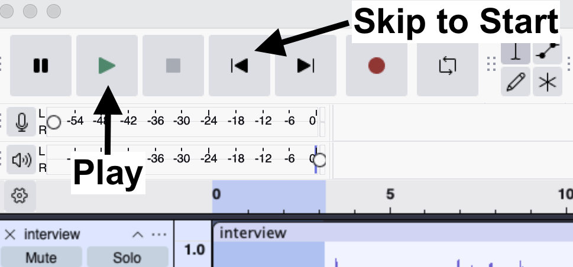 

Here is an example of my intro music trimmed and faded out. Notice in the [waveform](https://en.wikipedia.org/wiki/Waveform) how the intro music looks like it's fading down to smaller (quieter) as the interview track fades up to larger (louder). This is called a "crossfade."  

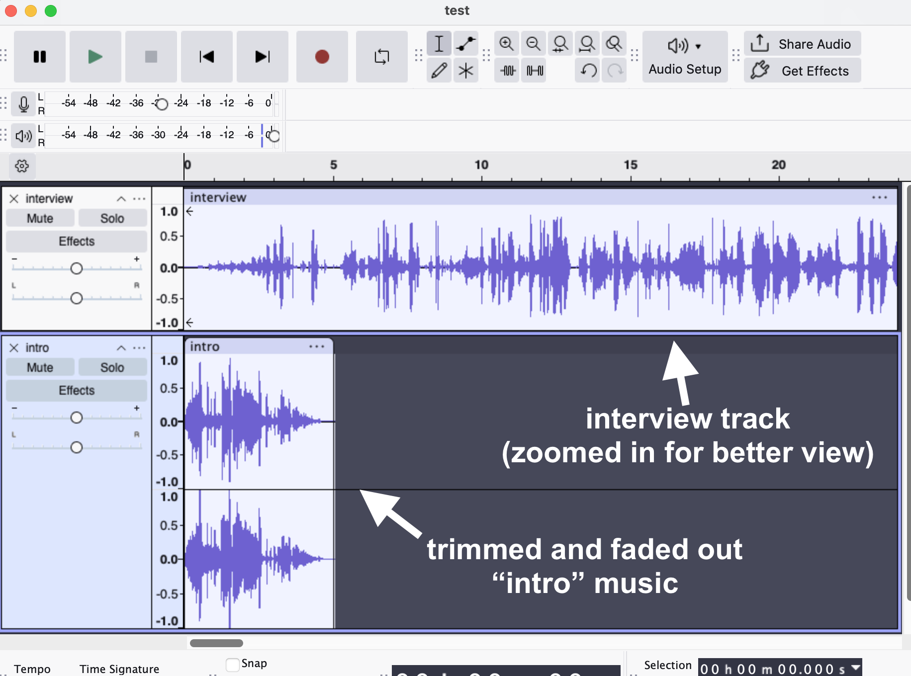

How did yours sound? Maybe you got lucky and it sounds good already. Bonus! 

**Do not expect things to sound perfect the first time**. For example, the music could overlap your interview too soon or too late, or the volume of the music might overpower the volume of your spoken audio content. 

Next, we will address the common issues in this process... 

### Troubleshooting your music tracks 

Chances are you will need to tweak things to improve your track alignment, volume, or both. 

### Troubleshooting: track alignment

**Problem**: you have faded your music track the way you want, but it is cutting in too early, or cutting off too late, for the timing with your main interview track. 

**Solution**: drag your main track into a better position: 
1. Hover your cursor over the top of the track (officially the "clip-handle drag-bar") until you see a white hand icon appear. See image at right. 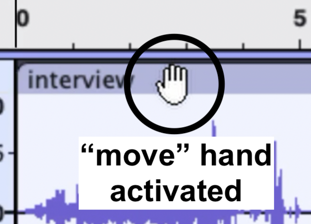 
2. Click + hold and **drag your track**, either left or right. 
3. Click on the **Skip to Start** button and listen to your the changes. 
4. Repeat steps 1-3 as needed. 

Here is an animation of the click + hold and drag process in an Audacity audio:

<button onclick="toggle('gif5')">Show/Hide Animation</button>

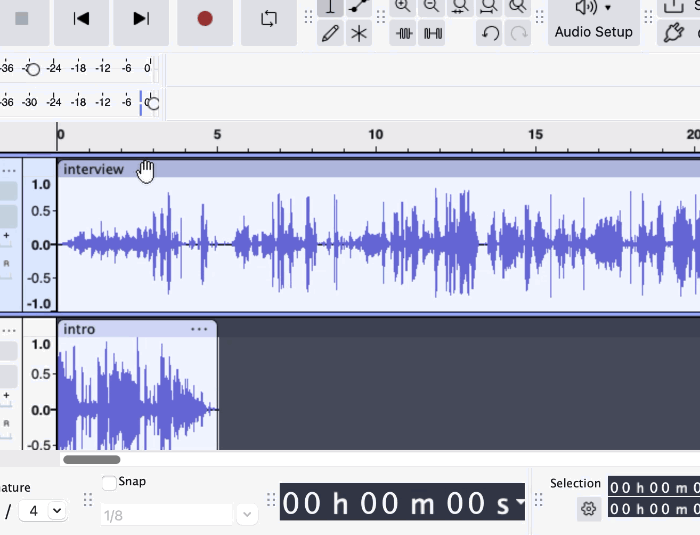 

### Troubleshooting: track volume

**Problem**: your music is either too loud or too quiet compared to your interview, or main track. 

**Solution**: use Audacity's "Amplify" feature to change volume:  
1. To select the whole track, click on the top of the track (officially the "clip-handle drag-bar"). You will see the track turn blue, compared to the other track, which indicates that the track is selected. 
2. In Audacity's main menu, select **Effect > Volume and Compression > Amplify**. This will open the "Amplify" window.  
3. **Use the slider** in the Amplify popup to increase or decrease the volume of your track, then click the **Apply** button. 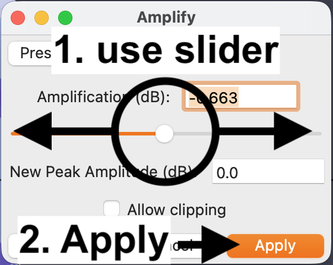 
4. Repeat steps 1-3 as needed. Remember to use **Edit > Undo** (in the main menu), or CTRL (Windows)/ Command (Mac) + Z on your keyboard if you are not happy with the results. 

>**NOTE** that you can apply the Amplify effect to _any_ Audacity audio track. You can also select a portion, or portions, of a track and apply the Amplify effect. You can learn more about the [Amplify effect in Audacity's manual](https://manual.audacityteam.org/man/amplify.html). 

## Add transition music to your podcast

The following instructions assume that you have already listened to your interview track, and that that you have picked at least one place to add transition music. 

To interrupt our interview track with transition music, we need to make space for the music to fit in as seamlessly as possible. There are a few ways to approach this. 

We could break up and save our interview into separate tracks, naming each track differently, but this is needlessly complicated at this point. 

We could also select a point in the interview track and use [Audacity's "Silence" feature](https://manual.audacityteam.org/man/silence.html) to insert a duration of complete silence into the track. While this feature can be very useful in some circumstances, it can be a little frustrating while we are still figuring out exactly where we want our transition(s) to land in the track. 

Instead, **we are going to "split" our interview track into separate parts**. Then, we will drag those parts, and our transition music, around until they both line up the way we want—just as we did in the "adding intro music" part of this workshop.   

Here are the **steps to adding transition music to your podcast**: 

1. In Audacity's tool menu, click on the **Selection Tool** button. 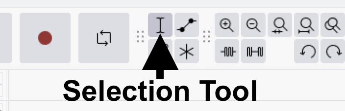
2. In the waveform of the interview track, click on where you want to split your track. You should see a thin, black line appear where you clicked. This line indicates exactly where your track will be split. 
3. Right-click with your mouse and select **Split Clip** from the popup menu's options. **Alternatively**, in the main menu, select **Edit > Audio Clips > Split**. You should now see two clips, with one to the left of the split and one to the right. 
4. Of the two split clips, drag the clip on the right toward the right, so that we can make some silent space for our transition clip to fill. Here is an animation of the whole process to this point: 
    <button onclick="toggle('gif6')">Show/Hide Animation</button>
    

    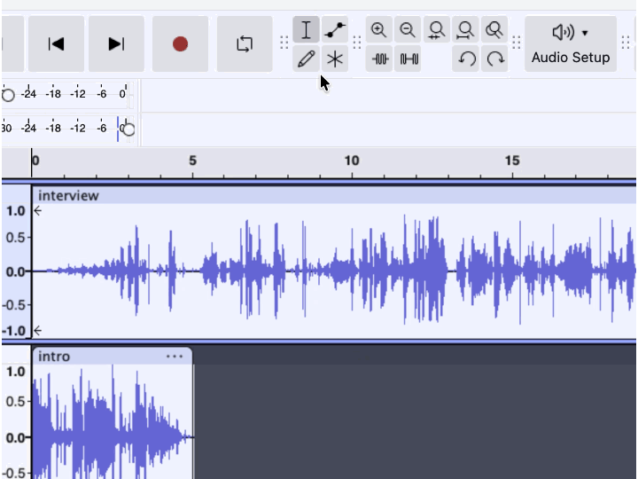 
    

Now that we have made some space, we will import the music we will use for the transition clip. 
5. In Audacity's main menu, select **File > Import > Audio**. Then, **navigate to your "transition.mp3" music file** and select the **"Open" button**. This will create another track in Audacity. 
6. Listen to your "transition" track to find roughly 5-8 seconds of music you would like to use. 
>**<mark>TIP</mark>**: to listen to _just_ the "transition" track (or any single track), you can click on the "Solo" button, or click on the "Mute" buttons in the other tracks. The muted tracks will appear to have a grey overlay. Click on either the "Solo" or "Mute" buttons, again, to deselect them. 
    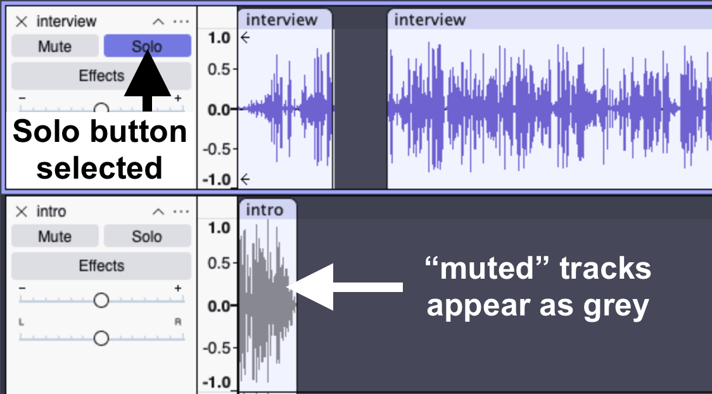
7. **Trim and fade** the beginning and ending of your transition clip: in Audacity's main menu select **Effect > Fading > Fade In or Fade Out, respectively.**
8. **Adjust the volume** of the transition clip: in Audacity's main menu, select **Effect > Volume and Compression > Amplify** and use the slider to increase or decrease volume as needed.
9. Drag the transition clip into the best position. Remember to use **Edit > Undo** as needed. 
10. **Save your Audacity project's file again** if you have not already done so, using CTRL or CMD + S on your keyboard. Or, in Audacity's main menu, select **File > Save**. 

Here is an example of my transition music trimmed and faded in/out. 

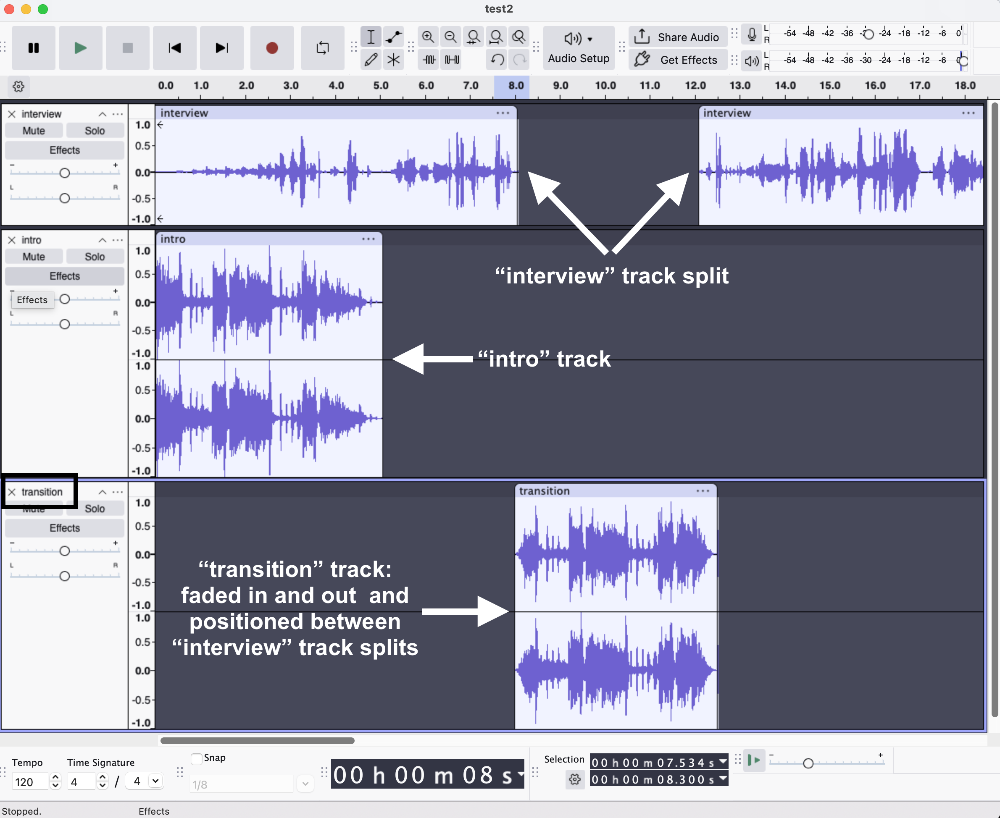

## Add outro music to your podcast

1. In Audacity's main menu, select **File > Import > Audio**. **Navigate to your "outro.mp3" file** and select the **"Open" button**. You should now see three tracks: your interview track, the "intro" track, and the "outro" track.
2. In the "outro" track, use your mouse to click, hold, and drag to **select all but roughly the last 8 seconds of the track**, then **hit delete on the keyboard**—or, in the main menu, select **Edit > Delete**. 
>**<mark>TIP</mark>**: remember to use [Audacity's zoom feature](https://manual.audacityteam.org/man/zooming.html) as needed to see your tracks more clearly.
3. Still on the the "outro" track, as you did for the "transition" clip, **add a fade in and a fade out**: in Audacity's main menu, select **Effect > Fading > Fade Out**.
4. **Drag your "outro" track into position** as needed, so that it lines up the way you want, relative to your interview track. 
5. **Save your Audacity project's file again** if you have not already done so, using CTRL or CMD + S on your keyboard. Or, in Audacity's main menu, select **File > Save**. 

Here is what my Audacity podcast project looks like at this point in the process, with interview, intro, transition, and outro tracks. Yours might not look exactly the same, depending on where you placed your music tracks: 

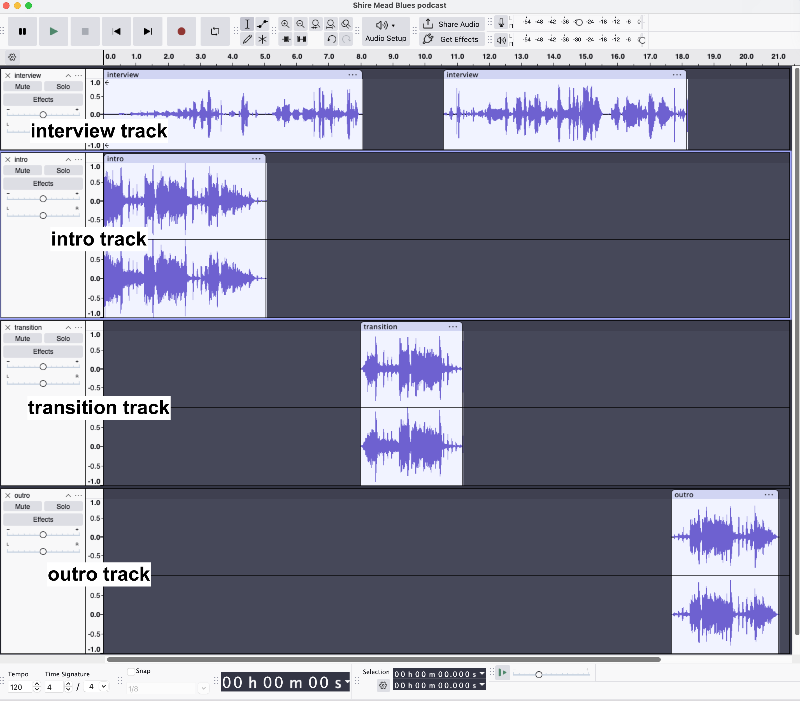

## Export your podcast to an MP3 file

&#127897; Now, it's showtime! 

As you learned in the [Exporting your audio in High MP3 quality](https://uviclibraries.github.io/podcasting/editing-audio.html#exporting-your-audio-in-high-mp3-quality) section, export your podcast as an MP3 file. 

>**NOTE**: remember to select "Mono" in the "Audio options" section of the Export Audio popup: 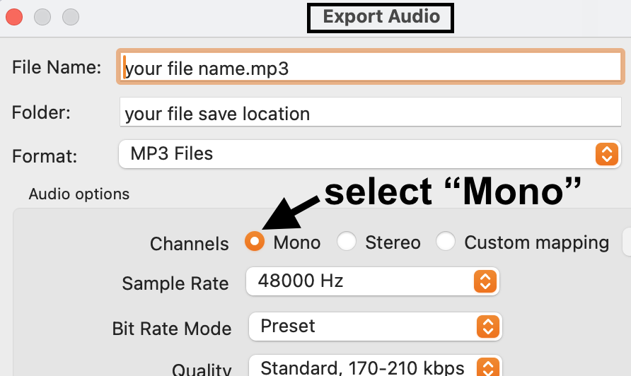

Here's a screenshot of my **metadata information**: 
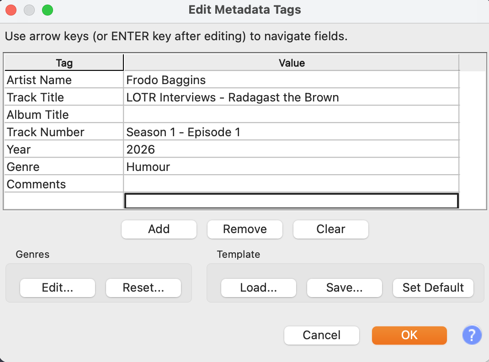

And, my **file export settings**:  
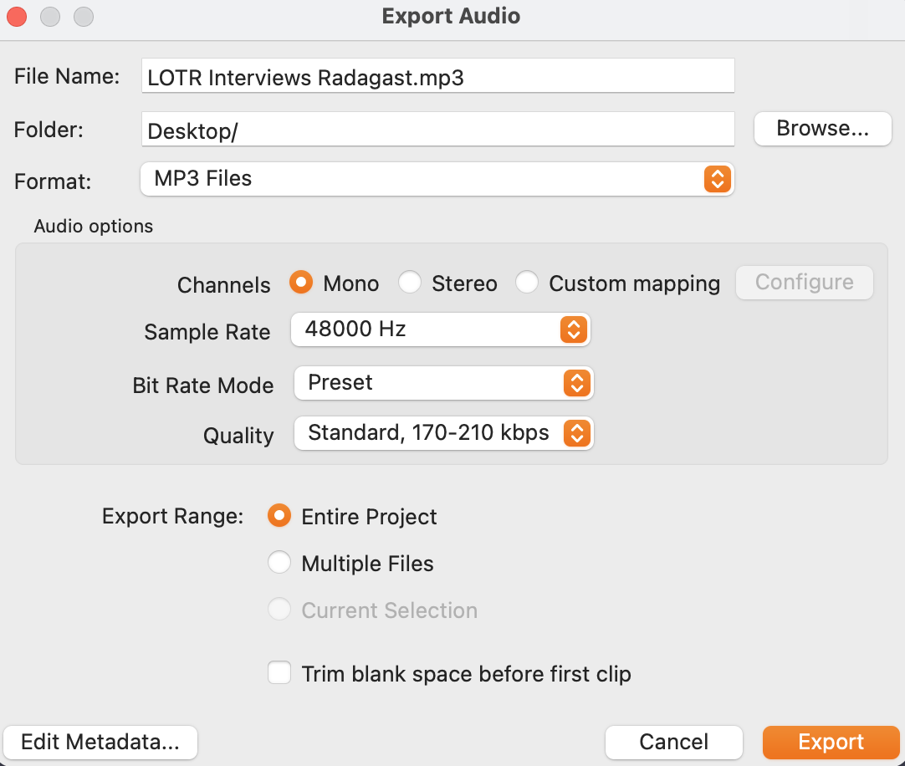
  

**Congratulations 🎉!** 

You have now created your first basic podcast, with fades and music. 

We have some options for what to do next... 

## Next steps

From here, you can choose your own podcast adventure: 

- move on to the [Remote Interviews with Zoom](https://uviclibraries.github.io/podcasting/recording-remote-interviews.html) page if you are using Zoom as part of your eventual process. 
- get some advice on publishing your podcast on the [Publishing Single Audio Interviews](https://uviclibraries.github.io/podcasting/publishing-single-audio-interviews.html) page, if you intend to make only one or a couple of episodes. 
- check out the [Publishing & Promotion for Ongoing Podcasts](https://uviclibraries.github.io/podcasting/publishing.html) for advice on publishing a serial, or multi-season podcast series.
- or, build on the skills you have learned to fine-tune your Audacity and audio-production chops in the [Next Level Audacity Tips](https://uviclibraries.github.io/podcasting/next-level-audacity.html) page. 
- finally, head to the [Planning and Tips](https://uviclibraries.github.io/podcasting/planning-tips.html) section for more podcast resources. 

[NEXT STEP: Recording remote interviews using Zoom](recording-remote-interviews.html){: .btn .btn-blue }
