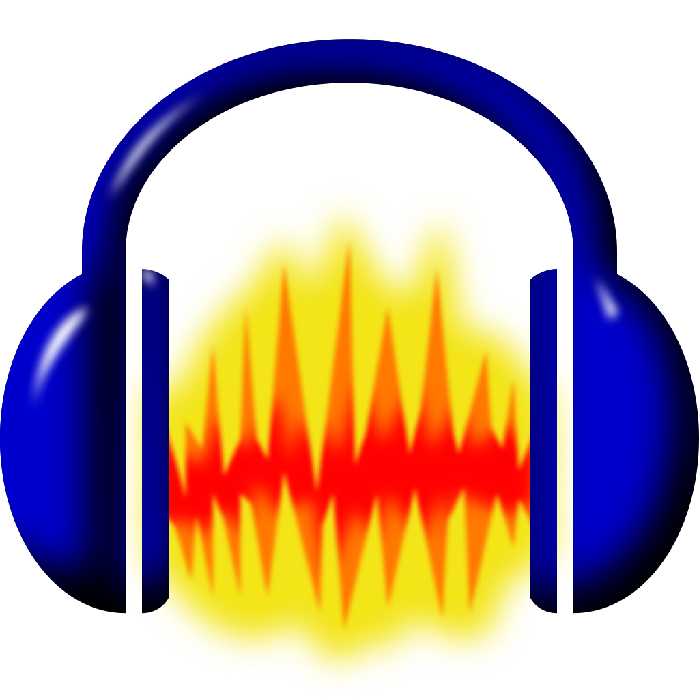
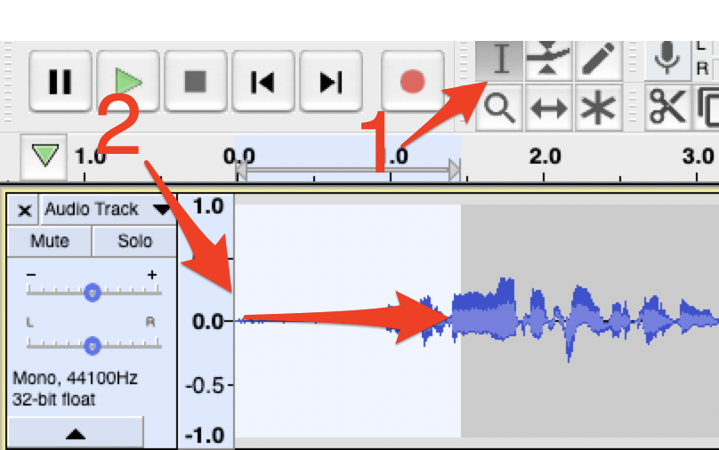
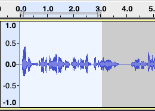
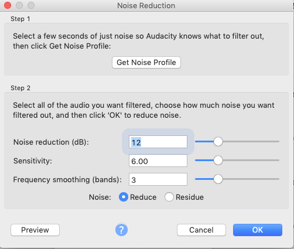

# Editing Audio in Audacity
Now that you have recorded some audio for your podcast, let’s do some editing! If you have any questions or get stuck as you work through this in-class exercise, please ask the instructor for assistance.  Have fun!

1. Please either use the audio you recorded in [Activty #1 - Podcast Recording with Audacity](recording-audio.html), or Download this [sample podcast interview file](https://web.uvic.ca/~rmccue/battle-bot-interview.mp3){:target="_blank"}, and then proceed to step 2 below.
- [Importing or exporting audio using FFmpeg instructions](https://support.audacityteam.org/basics/installing-ffmpeg){:target="_blank"}

2. Deleting audio from a track: Don't worry about cutting out filler words (uhms and ahs). Do pay attention to where breaths lie between sentences. It can be easy to cut breaths in unnatural ways and cause a "hiccup" or double-breath effect. Be careful not to accidentally cut off the beginning of a word (words starting with soft beginnings - "F", "H", "S" -are especially easy to accidentally cut). Let’s start by trimming the first few seconds of your audio track so that there isn’t an uncomfortable pause at the beginning and then do the same at the end: 
- Go to the Audacity menu bar, click on **Select tool** (see 1 above).  Go down to audio recording “timeline” and click on the very beginning of the audio track to the left (2) **Hover your cursor at the 0.0 mark.** **Click, hold, and drag to highlight** the first moments of blank audio before you began speaking. The background will turn white (see right).
- Press the **Delete** button on your keyboard to remove the audio.
- Do the same for the end of your audio recording, by **selecting the audio** you don’t want, press the **Delete** button on your keyboard.

<button onclick="toggle('gif1')">Show / Hide Animation </button>

- Delete audio from the middle of your audio track by **selecting** the audio you want to delete, and then press the **Delete** button on your keyboard.

3. Insert audio into the middle of your main audio track:
- **Select** a few seconds of audio from the middle of your recorded audio and, select **Edit -> Copy**. 
- Somewhere else in your audio track, where there is a gap in speaking, click on the timeline and then select **Edit -> Paste** to insert the audio clip.
- You can also copy voice, music, or background “silence" audio from another track and paste it into your main podcast interview audio track.
- For some versions of Audacity, there are buttons and others there are not, if there are no buttons, just use Edit on the top menu. 

<button onclick="toggle('gif2')">Show / Hide Animation </button>

4. Use fades and crossfades: Abrupt starts and stops sound unnatural. Use crossfades between sections of audio or use the room tone to mask the edits.
- Fade the beginning of your audio by **selecting the first 3 or 4 seconds audio** (on the far left of the track), and then on the top menu select **Effect -> Fade In**.
- Fade end of audio track by **selecting the last 3 or 4 seconds of audio** (on the far right of the track) and then on the top menu select **Effect -> Fade Out**.
- You can also fade music bumpers in and out in the middle of your recording (this is covered in more detail in the **Music Bumpers & Voiceovers** handout).

<button onclick="toggle('gif3')">Show / Hide Animation </button>

5. Background noise: steady, constant background noises like fans and hums are easily taken out in Audacity following these directions. It is much harder to take out random noises like other people talking or sirens.
- **Select** a “silent” section of your audio, where it’s just the background noise (like a fan).
- On the top menu Go to **Effects -> Noise Reduction**.
- **Click Get Noise Profile**.
- **Select** all of the audio from which you want that background noise removed.
- Go to the **Effects -> Noise Reduction**.
- Adjust the settings if necessary (defaults are fine) and click **OK**.
- Listen to ensure your audio doesn’t sound like it’s underwater.
- Below is what the before and after waveforms look like after applying the Noise Reduction effect:

<button onclick="toggle('gif4')">Show / Hide Animation </button>

6. You may want to eventually include some music bumpers or voiceovers, but for now, let’s practice export the audio in High MP3 quality:
- Select on the top menu: **File -> Export -> Export as MP3** and then click the **Save** button.
- Edit the meta-data for your podcast (this is optional). Click OK.
- If you haven’t already installed the free library to export MP3 files you will be prompted to download a free copy of “**LAME**” that will do this for you by pressing the Download button. Follow the installation directions for your operating system (ask for help if you have any problems). 

Great Job! 

[Installing FFMPEG](ffmpeg.html){: .btn .btn-green }

[NEXT STEP: Editing Audio Transitions & Voiceovers](editing-audio-transitions-voiceovers.html){: .btn .btn-blue }

