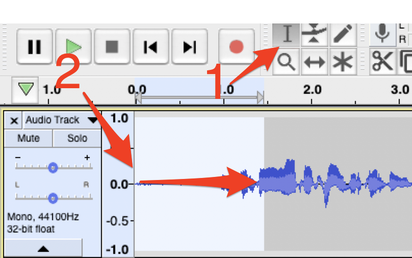
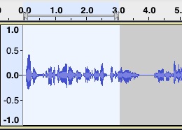
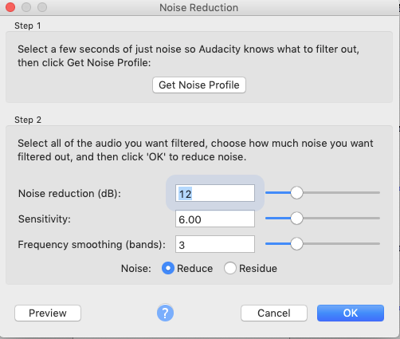
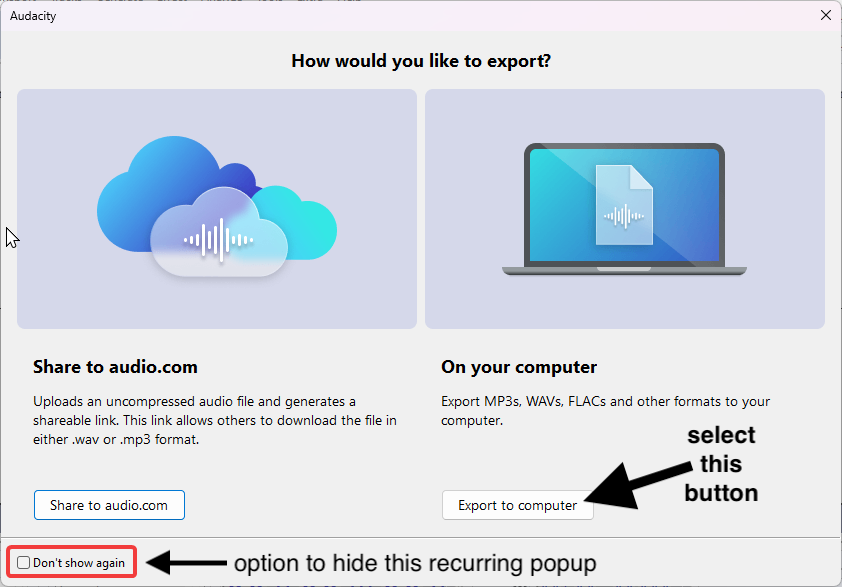
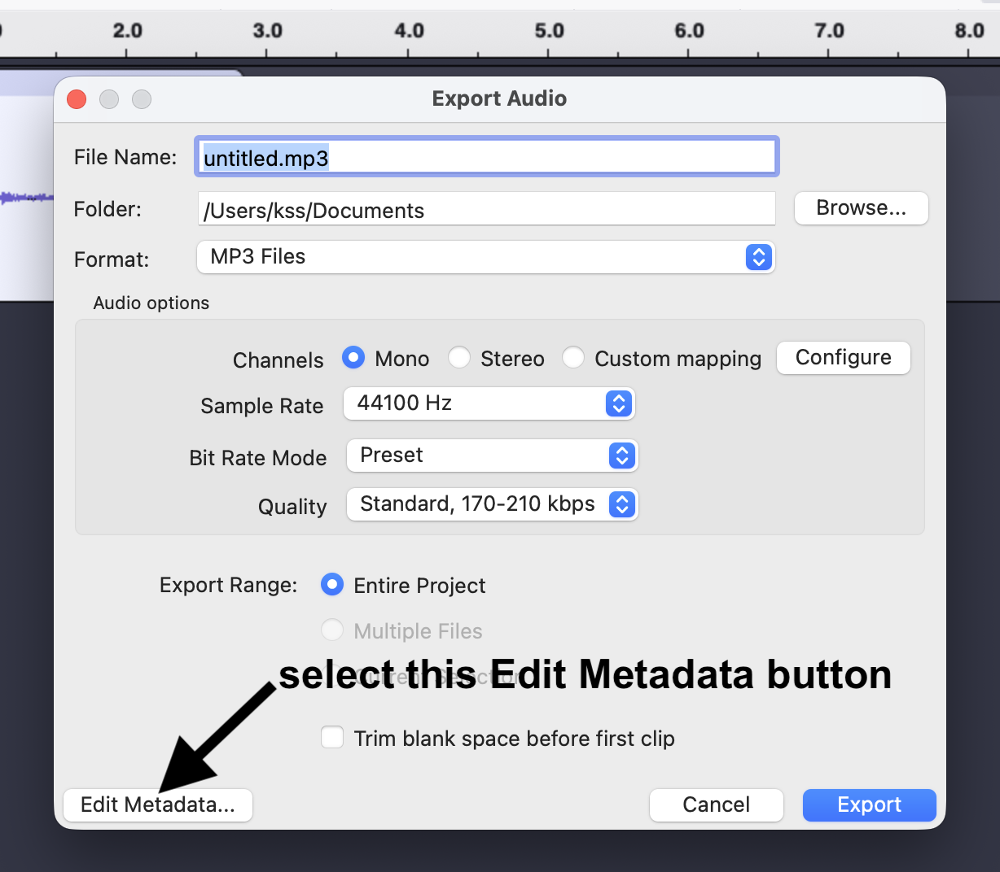
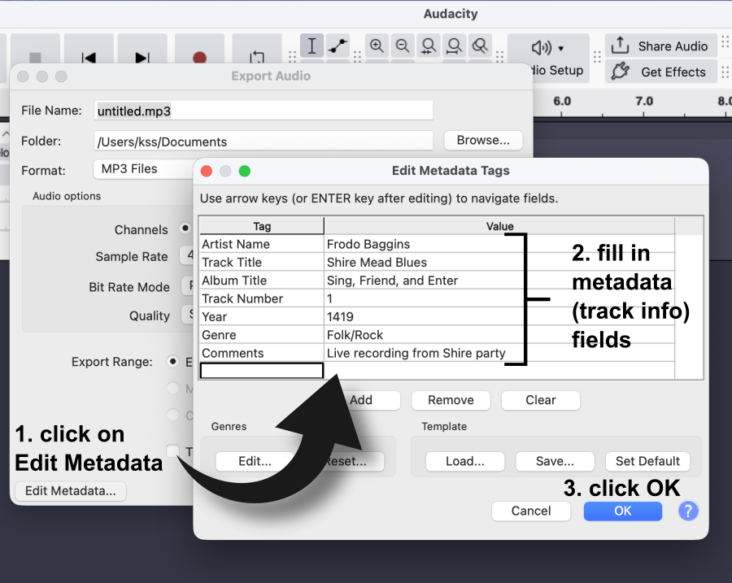

# Editing Audio in Audacity

Now that you have recorded some audio for your podcast, let’s do some basic editing. 

If you have any questions or get stuck as you work through this in-class exercise, please ask the instructor for assistance. 

Take your time and have fun &#128512;

For these exercises, please either use the audio you recorded in [Activity #1 - Podcast Recording with Audacity](recording-audio.html), or download this [sample podcast interview file](images/goat-girl.mp3)<!--{:target="_blank"}-->, and then proceed.

We will start by getting used to Audacity's editing features by trimming the first few seconds of your audio track. We are doing this so that there isn’t an uncomfortable pause at the beginning of your track. 

Then, we will trim the end of the track in the same way. 

### Trimming the track start and end

Nearly all recordings will have some preamble and closing sounds to remove. For example, the time between hitting the record button and beginning your introduction, you might have a light cough. Or, you might take a pause at the end of an interview to ensure that you don't cut things off too soon. 

Here are the steps to removing the unwanted sounds from the beginning and end of your track:  

1. In Audacity, look in the main menu bar and click on the **Selection Tool icon**.
2. In the Audio Track, **hover your cursor over the very beginning of the audio track** (to the farthest left, near the left "0.0" mark), then **click, hold, and drag to highlight** the part of the track you want to remove. Whatever you have selected will turn the background lighter in colour.
3. On your keyboard, press the **Delete** button to remove the audio you selected.
4. Follow the same process at the end of your audio track by **selecting the audio** you don’t want and pressing the **Delete** button on your keyboard.

    <button onclick="toggle('gif1')">Show / Hide Animation </button>
    

    
    

As you did for trimming the beginning and end of the track, you can select audio from anywhere middle of your audio track, and then press the **Delete** button on your keyboard.

### Inserting or copying audio into your audio track

This is helpful in situations where you might want to move the order of your content around. For example, in an interview recording, you might want to change the order of a question and answer. 

Here are the steps to inserting or copy audio into your audio track: 

1. **Select** a few seconds of audio from the middle of your recorded audio, then, in the main menu, select **Edit -> Copy**. 
2. Somewhere else in your audio track, where there is a gap in speaking, click on the timeline and then select **Edit -> Paste** to insert the copied clip.

You can follow this same copy/paste process to move any audio from any Audacity track to another.

> **NOTE**: the locations of buttons in Audacity's interface vary from version to version and system to system (i.e., Windows, Mac, or Linux). If you do not find what you are looking for, rely on the main menu to **Edit -> Copy / Edit -> Paste**.  

<button onclick="toggle('gif2')">Show / Hide Animation </button>

### Adding fades

We add fades (moving from quiet to loud, or loud to quiet) to address abrupt starts and stops in your audio track, which can sound jarring. 

Fading in and out of a track also signals to your listener that your track is about to start or end, respectively.  

Here are the steps to add fades to your audio track:

1. **Fade the beginning** of your audio by **selecting the first 3 or 4 seconds audio** (on the far left of the track), and then on the top menu select **Effect -> Fade In**.
2. **Fade the end** of your audio track by **selecting the last 3 or 4 seconds of audio** (on the far right of the track) and then on the top menu select **Effect -> Fade Out**.

You can also apply these fade techniques to any part of an Audacity track, including music, which we will learn about later.

<button onclick="toggle('gif3')">Show / Hide Animation </button>

<!--  KSS note: I commented out this image link because this page does not address Noise reduction -->

### Exporting your audio in High MP3 quality

We still have more to do for a finished product, like adding music "bumpers" (transition or break music), or voiceovers. 

Before we begin, note that **"saving" your file is different than "exporting" an audio track**, in this case, our podcast.

In Audacity, selecting **File -> Save** will save the Audacity project, which has a ".aup" file extension. On the other hand, exporting your file combines, or mixes, everything in your Audacity tracks down into one audio file to be played on an audio player or audio software. 

To get used to the export process, let’s **practice adding metadata (track information)** and then **exporting an MP3 file**. 

>**NOTE** that [Audacity can export a variety of file types](https://manual.audacityteam.org/man/export_formats_supported_by_audacity.html). We are working with [MP3 files](https://simple.wikipedia.org/wiki/MP3) because they are a common file format, meaning that they can be played by nearly all music players and music software. 
>
>As a file type, MP3 provides a good balance of sound quality and small file size.   

Here are the steps for exporting your audio track:

1. In Audacity's main/top menu, select **File -> Export Audio**.
>**NOTE** that the first time you do this, you might see a popup that allows you to choose from two options: "Share to audio.com" and "Export to computer." Choose the "Export to computer option." You can also disable this recurring popup by selecting the "Don't show again" checkbox to the bottom-left of the popup. 
>
>
2. In Audacity's **"Export Audio" popup** click on the **"Edit Metadata" button**.

3. **Enter your metadata information** into Audacity's metadata (track information) popup and **click on the OK button**. Add as much or as little information as you like. We recommend adding at least the "Track Title" information. 

>**NOTE** that the information you put in these metadata fields will appear as track information in audio players and audio player software. For example, if you connect your phone to your car's audio system, you will see some or all of your track's information in your car's audio display, depending on your car's stero features, of course. 
>
>Typically, most modern digital audio software, like Spotify, YouTube Music, or VLC Media Player, etc., will display at least the following track information: Artist Name, Track Title, Album Title, Track Number, and Year. 

>**<mark>TIP</mark>**:  
- Audacity might ask you to install FFMPEG in order to export an mp3 file. See these instructions for details:

[Installing FFMPEG](ffmpeg.html){: .btn .btn-green }

[NEXT STEP: Editing Audio Transitions & Voiceovers](editing-audio-transitions-voiceovers.html){: .btn .btn-blue }

