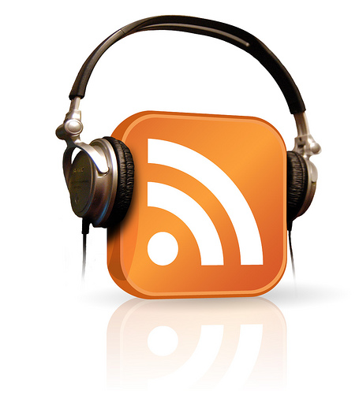

 

# Introduction to Podcasting with Audacity

Pre-workshop activities: 15 min 
Introductory presentation: 10 min
Hands-on activities: 80 min

## Why Audacity? 

[Audacity](https://www.audacityteam.org/) is an [open-source software](https://en.wikipedia.org/wiki/Open-source_software) that allows you to edit and add effects to your audio projects. This software has numerous features that will help develop your podcasting skills. Learn more about these features through our workshop activities.

## Learning objectives 

In this workshop, **participants will learn about the following:** 
- the key features of an ongoing podcast or a one-off podcast
- best practices for interviewing people or panels of people for podcasts
- where to borrow high-quality audio recording equipment on campus
- the pros and cons of free and paid podcast publishing services

In this workshop, **participants will learn to do the following:** 
- to record high-quality audio using a USB-connected microphone 
- to trim and split recorded audio
- how to create voiceovers
- how to fade audio in and out in separate audio tracks
- to use a free podcasting publishing service
- to publish a stand-alone audio interview or recording
- OPTIONAL: Use Zoom to record remote interviews

[Image credit](https://www.flickr.com/photos/abletoven/3223086466)

[NEXT STEP: Pre-Workshop Activities](pre-workshop.html){: .btn .btn-blue }
