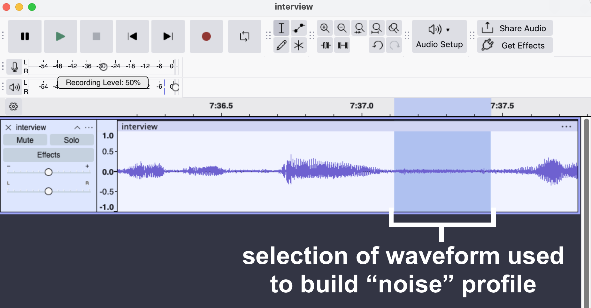
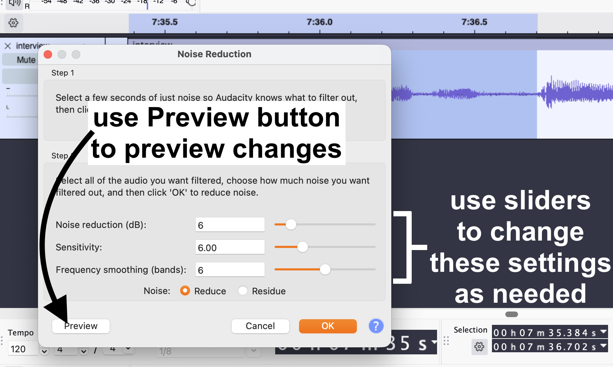

# Next level Audacity tips

This section is our Audacity tips and troubleshooting guide. It is intended for folks who have some practice with the basics of working in Audacity, as described in the [Podcast recording with Audacity workshop](https://uviclibraries.github.io/podcasting/recording-audio.html) and who want to learn more tricks and tips to improve audio quality, or level-up their Audacity skills a little more.  

We have curated this list to appeal to beginners. Where helpful, we provide links to [Audacity's Manual](https://manual.audacityteam.org/index.html) pages, and other resources, for those wishing to dive deeper into certain Audacity features. 

# Audacity tips

## Noise Reduction

**Purpose**: to remove unwanted background noise(s), like the hums of background traffic, or the hiss of a fan or other electronics. The Noise Reduction effect generally works best with consistent noise, not sharp spikes in sound. 

**Menu location**: Effect > Noise Removal and Repair > Noise Reduction...

### How to use Noise Reduction

In overall terms, we first have to teach Noise Reduction tool to identify the noise we want to remove, then we apply the effect. 

1. Use the [Selection Tool](https://manual.audacityteam.org/man/selection_tool.html) to **select a portion of the waveform that contains only the noise we want to remove**. For example, in the case of a buzzing sound during an interview, you would select the part of the waveform between people talking.   
2. In Audacity's main menu, **select Effect > Volume and Compression > Noise Reduction**. You will see the Noise Reduction popup. 
3. In Noise Reduction popup, click on the **Get Noise Profile** button. **NOTE** that the popup window will close. This is normal: **it has now gathered a noise profile that will remain until you close Audacity**. 
4. Select all or some of the track to which you want to apply  the Noise Reduction effect. 
5. In Audacity's main menu, **select Effect > Volume and Compression > Noise Reduction**. You will see the Noise Reduction popup again. 
6. Experiment with the Noise Reduction option (the sliders) to produce the desired effect:
    - **Noise Reduction (dB)**: controls the volume of reduction to be applied to the noise, in other words, how much of the noise to remove, relative to the rest of the sounds. The default setting is 6, but this will likely need to change. 
    - **Sensitivity**: determines how much of the audio is  considered "noise." This setting is important to get right. If you set this too high, then your track will have "artifacts," like strange tones or chirps. The default setting is setting is 6.00, but experiment with this. 
    - **Frequency Smoothing (bands)**: sounds are collections of various frequencies, and this tool allows you to tweak which ranges of frequencies are changed by the Noise Reduction effect, based on the noise profile you gathered when you clicked on the Get Noise Profile button. If your noise is light, try setting this to 0 (off). In general, settings lower than 6 (the default) favour music and higher settings favour spoken word. 
    - <mark>**TIP**</mark>: to preview _just_ the noise being removed, select on the **Residue** button, then the **Preview** button.   
7. Assuming that you are happy with the results of your tweaks, click on the **OK button** to apply your effect. 

**Tips**: remember to use CTRL/CMD + Z to undo any unwanted changes. Closing Audacity will remove the saved Get Noise Profile. So, if you need to start again, and get a new noise profile, save your project, close Audacity, and reopen it. 

See the [Audacity Manual page on Noise Reduction](https://manual.audacityteam.org/man/noise_reduction.html) for more details.

## Normalize

**Purpose**: The Normalize effect, among other things, sets the same peak amplitude (volume) within a track, or selection of a track. Think of it as "regularizing" the loud and quiet sections within an audio track. 

This effect is different than [Amplify](https://manual.audacityteam.org/man/amplify.html), and is very helpful in cases where you have, for example, conducted an interview with someone who speaks inconsistently: they are quiet sometimes, then suddenly loud for a while, but throughout the whole recording. 

Or, maybe both you and the interviewee burst out laughing, which created a spike in volume that you want to reduce, relative to the rest of the track.  

**Menu location**: Effect > Volume and Compression > Normalize...

### How to use Normalize 

For this **example**, we will use a **selection of a mono audio track** that is much louder than the audio on either side of it. 

The goal is to make sure that this section of audio sounds similar to the rest, and to make sure that it does not [clip](https://en.wikipedia.org/wiki/Clipping_(audio)), or be so loud as to be distorted.

1. Use the [Selection Tool](https://manual.audacityteam.org/man/selection_tool.html) to **select a portion of loud audio**. 
2. In Audacity's main menu, select Effect > Volume and Compression > **Normalize**. You will see the Normalize popup. 
3. **Leave the default settings** alone and click on the **Apply** button. Here is an image of the process:    And here is an image of the results on the selected audio. Notice how the clip we selected has peaks much closer to the audio on either side of it: 

**Tips**: you can apply Normalize to an entire clip (mono or stereo) by double-clicking anywhere in the track to select it (the track will have a blue overlay to show it is selected), and applying Normalize. 

Note that with stereo tracks, you have the option to "Normalize stereo channels independently." This approach can be helpful in cases where you want to preserve the relative balance of levels in each track independently. 

See the [Audacity Manual page on Normalize](https://manual.audacityteam.org/man/normalize.html) for more details. 

# Audacity troubleshooting

## Installing FFmpeg

Depending on what type of audio files you import or export in Audacity (and your version of Audacity), you might be prompted by Audacity to install a software suite called [FFmpeg](https://en.wikipedia.org/wiki/FFmpeg). 

Basically, FFmpeg allows you to work with a variety of audio file types not already handled by Audacity by default. In other words, you will be able to import and export pretty much any file type you would ever need to if you have FFmpeg installed.  

**Audacity's Support website** walks you through **how to install FFmeg** for Windows, Mac, and Linux. **See [Installing FFmpeg](https://support.audacityteam.org/basics/installing-ffmpeg)** for more.

