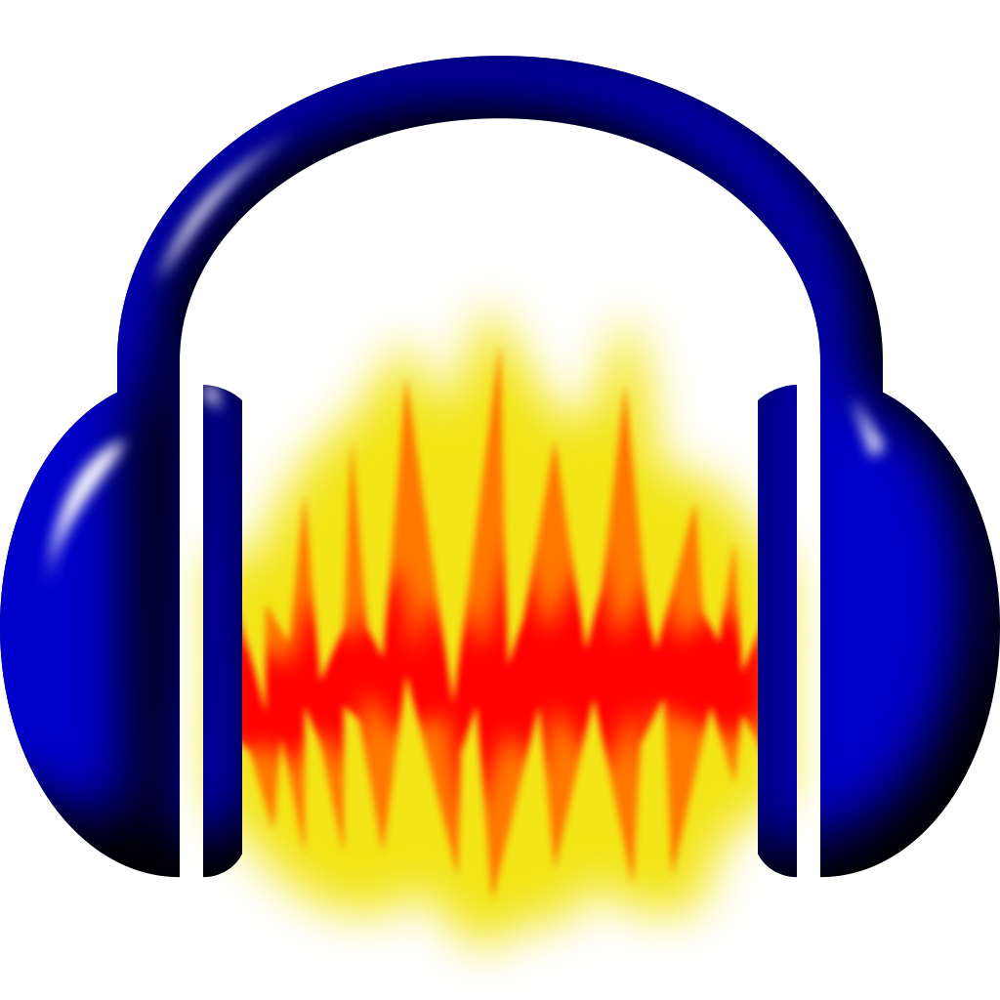
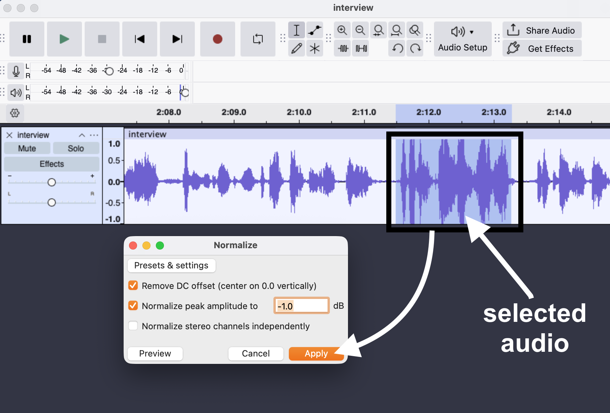
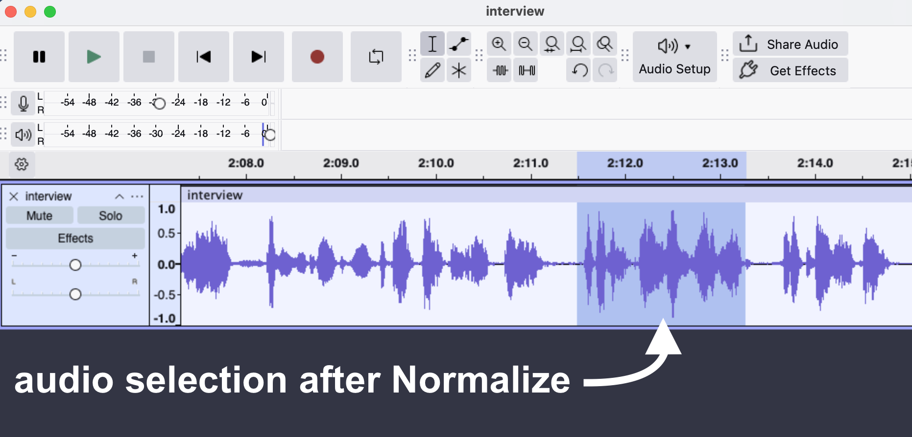
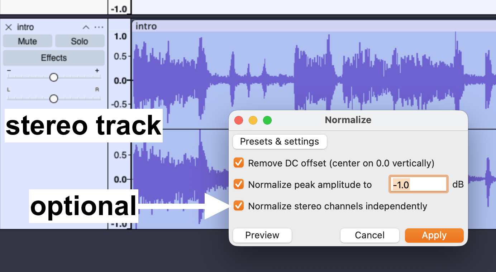

# Next level Audacity tips

This section is our Audacity tips and troubleshooting guide. It is intended for folks who have some practice with the basics of working in Audacity, as described in the [Podcast recording with Audacity workshop](https://uviclibraries.github.io/podcasting/recording-audio.html) and who want to learn more tricks and tips to improve audio quality, or level-up their Audacity skills a little more.  

We have curated this list to appeal to beginners. Where helpful, we provide links to [Audacity's Manual](https://manual.audacityteam.org/index.html) pages, and other resources, for those wishing to dive deeper into certain Audacity features. 

# Audacity tips

## Normalize

**Purpose**: The Normalize effect, among other things, sets the same peak amplitude (volume) within a track, or selection of a track. Think of it as "regularizing" the loud and quiet sections within an audio track. 

This effect is different than [Amplify](https://manual.audacityteam.org/man/amplify.html), and is very helpful in cases where you have, for example, conducted an interview with someone who speaks inconsistently: they are quiet sometimes, then suddenly loud for a while, but throughout the whole recording. Or, maybe both you and the interviewee burst out laughing, which created a spike in volume that you want to reduce, relative to the rest of the track.  

**Menu location**: Effect > Volume and Compression > Normalize...

### How to use Normalize 

For this **example**, we will use a **selection of a mono audio track** that is much louder than the audio on either side of it. The goal is to make sure that this section of audio sounds similar to the rest, and to make sure that it does not [clip](https://en.wikipedia.org/wiki/Clipping_(audio)), or be so loud as to be distorted.

1. Use the [Selection Tool](https://manual.audacityteam.org/man/selection_tool.html) to **select a portion of loud audio**. 
2. In Audacity's main menu, select Effect > Volume and Compression > **Normalize**. You will see the Normalize popup. 
3. **Leave the default settings** alone and click on the **Apply** button. Here is an image of the process:    And here is an image of the results on the selected audio. Notice how the clip we selected has peaks much closer to the audio on either side of it: 

**Tips**: you can apply Normalize to an entire clip (mono or stereo) by double-clicking anywhere in the track to select it (the track will have a blue overlay to show it is selected), and applying Normalize. 

Note that with stereo tracks, you have the option to "Normalize stereo channels independently." This approach can be helpful in cases where you want to preserve the relative balance of levels in each track independently. 

See the [Audacity Manual page on Normalize](https://manual.audacityteam.org/man/normalize.html) for more details. 

# Audacity troubleshooting

## Installing FFmpeg

Depending on what type of audio files you import or export in Audacity (and your version of Audacity), you might be prompted by Audacity to install a software suite called [FFmpeg](https://en.wikipedia.org/wiki/FFmpeg). 

Basically, FFmpeg allows you to work with a variety of audio file types not already handled by Audacity by default. In other words, you will be able to import and export pretty much any file type you would ever need to if you have FFmpeg installed.  

**Audacity's Support website** walks you through **how to install FFmeg** for Windows, Mac, and Linux. **See [Installing FFmpeg](https://support.audacityteam.org/basics/installing-ffmpeg)** for more.

