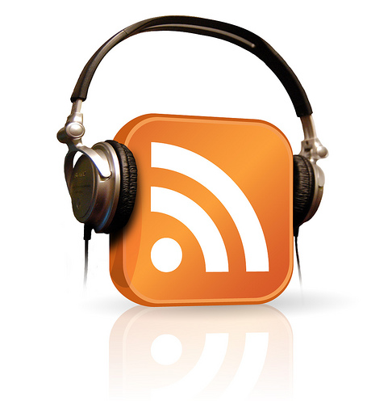

# Podcasting Tips
A podcast is a series of digital audio files, often focused on a particular topic, that are posted on the Internet for people to download and listen to. This guide will walk you through the steps of creating your own podcast series or stand-alone audio recording from planning to publishing. At a very high level, you should follow the steps below:

1. **Brainstorm a name, topic, and format**:
- Consider what is the premise, who is the audience, what is the format of your podcast?
- Plan the specifics of each episode (if you plan on having more than one episode).
- Plan the frequency of episodes. Weekly? SemiMonthly?
2. **Prepare interview questions or an audio script**:
- If you're interviewing a guest, research them and decide on 5-15 questions to ask, depending on the topic, and the length of your podcast episode.
- If the podcast is narrative, draft an audio script.
3. **Assemble your equipment**:
- Borrow equipment from the Music & Media desk in the library - audio equipment has a loan period of one day with the option of one renewal. [More information here](https://www.uvic.ca/library/use/borrow/av/index.php){:target="_blank"}
- You can also attend a workshop to learn what equipment you can borrow, and what audio editing tools are available at Music & Media.
4. **Rehearsing**:
- Find a quiet place with minimal distractions. Try to avoid outdoor interviews or locations with a fan or AC noise.
- Practice like you will record; try to align your rehearsal environment as closely as possible with the environment you will be in when you record.
- Imagine an audience member speaking to them, with your personality and style.
- Speak slowly and consistently and try to maintain a constant distance from the microphone.
5. **Record all original audio**:
- Make sure you are familiar with your equipment and have tested it several times before recording, especially if you will be recording with guests or collaborators.
- If possible, have a backup recording device (like your phone) in case of technical difficulties.
- Make sure you are in a quiet place without interruptions or fan noise.
- Record one full minute of ‘room tone,’ or ambient sound of your recording environment that can be used when editing.
- Record your interview(s) or the body of your audio script.
- Use Skype to record any remote interviews, as needed.
- Then record your intros and outros and any transitions between segments.
6. **Record or download additional assets**:
- Find Creative Commons licensed and free to use (when cited) music to set the mood of your audio project from places like [archive.org/details/audio](https://archive.org/details/audio){:target="_blank"}.
- Use sound effects to add aural texture.
- Check to see if your microphone is picking up any unwanted ambient noise by going to the top Audacity menu and selecting **Transport -> Transport Options -> Software Playthrough**. Click on “**Click to Start Monitoring**” in the left audio indicator menu, and you will hear everything that your microphone is picking up.
7. **Edit audio**: 
- Use Audacity or GarageBand to edit together all of your media. If you do not have experience editing audio, we recommend you take the UVic Libraries DSC Podcasting workshop.
- Edit using high-quality headphones, but then listen back to your finished recording using common consumer-level audio equipment that your listeners will likely use (like a phone with earbuds) so you can hear how it will sound to your audience.
8. **Upload podcast** to Soundcloud or another hosting platform:
- Soundcloud is a free platform for hosting audio files.
- List your podcast on iTunes, Spotify, TuneIn, and Stitcher for a wider listener base.
9. **Promote your podcast project**:
- Consider making a website, a Facebook, Instagram, and/or a Twitter account to promote your podcast.
- Ask people who listen to write reviews.

## Podcast Recording Equipment You Can Borrow from Music & Media in the Library
All of the equipment listed below can be borrowed from the Libraries’ Music & Media desk on the main floor in the newer portion of the building:
- USB Microphones for your laptop
- High-quality headphones
- Mixing board & microphones (coming soon)
- Editing Room (is undergoing sound dampening)
- 27” iMac computers
- Laptops
- Portable audio recorders

[NEXT STEP: Sample Podcast Script](sample-podcast-script.html){: .btn .btn-blue }
