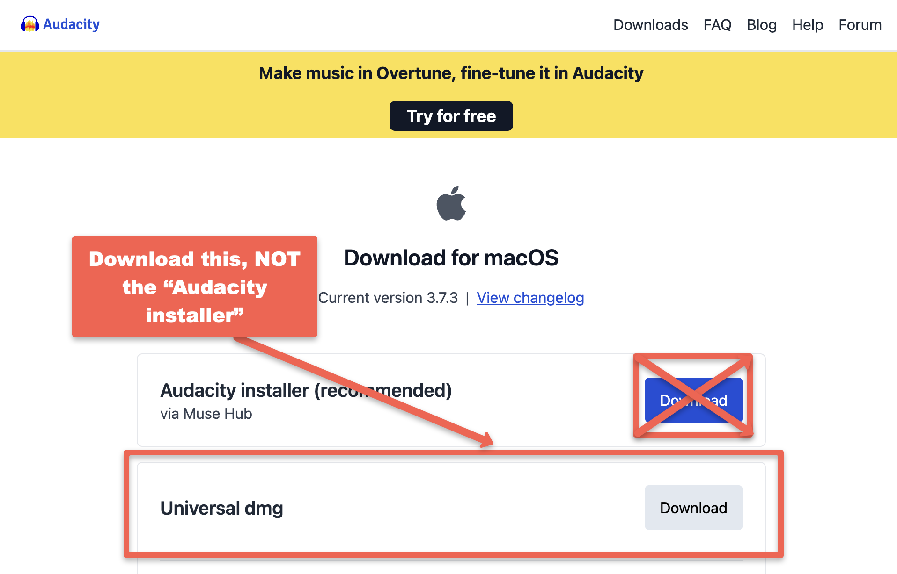

## Pre-Workshop Videos & Activities
This workshop is primarily hands-on practice with Audacity in order to learn to use key features of the software. To participate fully please do the following **before the workshop**:

**8 minutes or less. Optional videos: 32 minutes** 
- [Install Audacity on your laptop](https://www.audacityteam.org/download/){:target="_blank"}. For Mac computer select the **universal DMG** file, and for Windows, the **64-bit installer**. Do not install the ~~Audiacity installer via Muse hub~~! 
 
- [Should I Make a Podcast?](https://www.youtube.com/watch?v=zzLdlGDujZc){:target="_blank"} (4 min)
<iframe width="560" height="315" src="https://www.youtube.com/embed/zzLdlGDujZc" title="YouTube video player" frameborder="0" allow="accelerometer; autoplay; clipboard-write; encrypted-media; gyroscope; picture-in-picture" allowfullscreen></iframe>
- [Planning your Podcast](podcast-planning.html){:target="_blank"}(5 min) 
- [Sample Podcast Script](sample-podcast-script.html){:target="_blank"}(2 min)
- OPTIONAL: [Podcasting 101 from PRX & Google Podcasts](https://www.youtube.com/playlist?list=PL7I-Eysv4kq4P9a_942suQdE1_0WiFxFo){:target="_blank"} - an excellent series of 10 short videos that cover the podcasting creation process from start to finish and includes a video on monetization that is a topic not covered in the DSC workshop

[NEXT STEP: Introduction to Hands-On Activities](activities-intro.html){: .btn .btn-blue }
