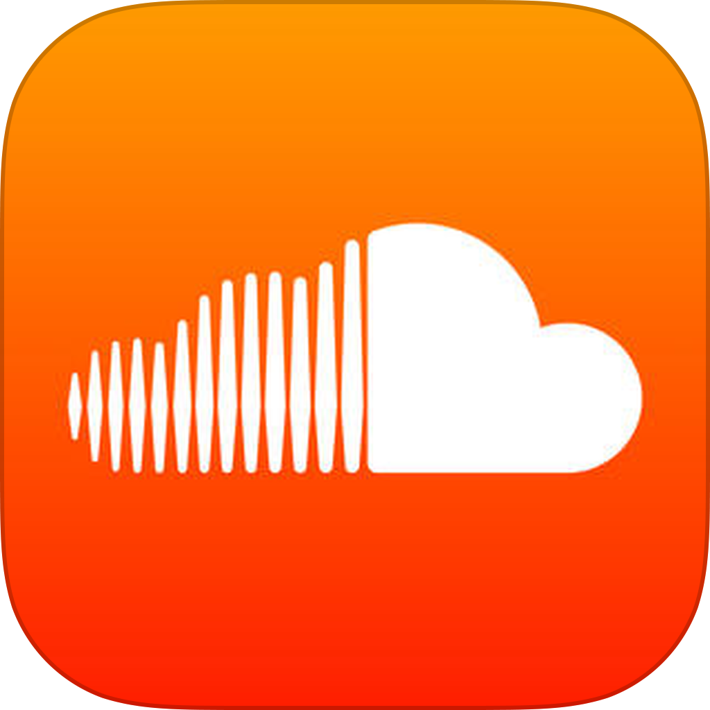

# Publishing Single Audio Interviews
When your podcast is completed, you need a place to host your episodes. Media hosts are services that store your audio and allow your listeners to listen and download.

If you have any questions or get stuck as you work through this in-class exercise, please ask the instructor for assistance.  Have fun!

1. Many podcasters choose to store their podcasts on **Soundcloud**. 
- A free account has limits on storage space but is a good place to start - you can always upgrade to a Pro account. 
- Check out notes from Soundcloud about uploading an [audio file](http://bit.ly/35zNY6J){:target="_blank"} 

2. You can also publish your audio file to your **personal UVic webspace**:
- [Create your personal UVic website](http://bit.ly/2QRZoQ){:target="_blank"} 
- [Upload your MP3 audio file to your webspace](http://bit.ly/2qJdPd){:target="_blank"} 
- Promote the URL for your audio file. 

Great Job! 

[Based on the CC-licensed VCU podcasting guide](https://guides.library.vcu.edu/podcast/editing){:target="_blank"} 

[NEXT STEP: Publishing & Promotion for ongoing podcasts](publishing.html){: .btn .btn-blue }
