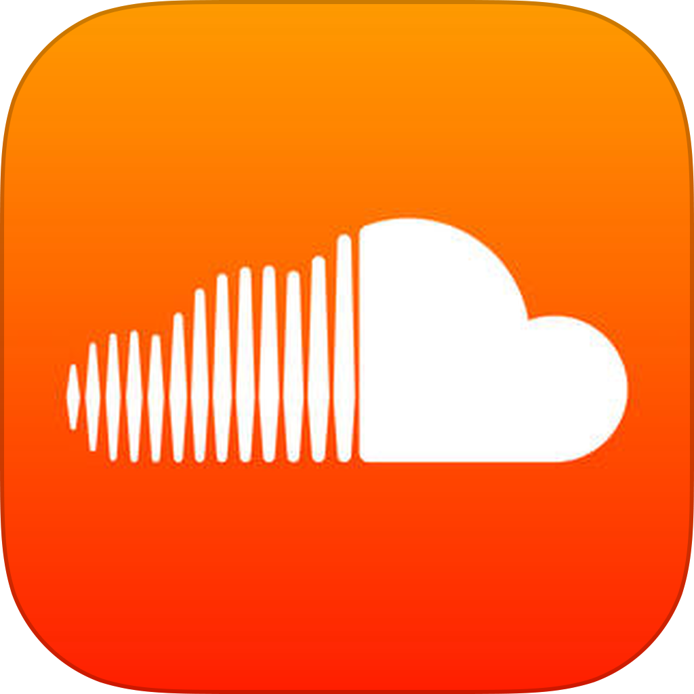

# Publishing single audio interviews

When your podcast is complete, you will need a place to host your episodes. Media hosts are services that store your content, including audio files (podcasts), and that allow  listeners to listen or watch, and download your content.

Here's a **list of hosting options**:

1. **[Soundcloud](https://soundcloud.com/)**: many podcasters choose to store their podcasts on Soundcloud. **NOTE** that a free Soundcloud account has limits on storage space, but it is a good place to start. You can always upgrade to a pro account, later. If you feel like Soundcloud could work for you, then you can [create a Soundcloud account](https://soundcloud.com/signin?redirect_url=/artists). Then, check out the [Soundcloud for Artists site](https://soundcloud.com/getstarted/home). 
2. **[GitHub](https://github.com/)**: normally a service for open source software development projects, you can use [GitHub Pages](https://docs.github.com/en/pages/getting-started-with-github-pages/what-is-github-pages) to create a basic website for free. Then, you can upload your podcast files(s) to that website.
  >**NOTE**: We have a tutorial called [Publish Your Twine Story or HTML Files on the Web Using GitHub Pages](https://uviclibraries.github.io/twine/github.html). Although these instructions apply to creating your own "Twine Story" website, the process is the same for any GitHub Pages site creation. 
4. **UVic webspace**: this **applies to University of Victoria students and employees, only**. You can create a web page to which you publish your audio file(s). See UVic's [Self-serve web hosting](https://www.uvic.ca/systems/services/pages/web-hosting.php) page for details. 

The world of podcasting and podcast hosting changes constantly. As of this writing, podcasters are using [YouTube](https://www.youtube.com/) (free), [Buzzsprout](https://www.buzzsprout.com/blog/how-to-start-a-podcast) (paid), [Spotify for Creators](https://creators.spotify.com/features/podcast) (free), and others. 

So, if you are not happy with the above suggestions, know that other options exist. Do some research, and be sure to read user reviews for each service.  

Good luck and happy podcasting! 

[NEXT STEP: Publishing & Promotion for ongoing podcasts](publishing.html){: .btn .btn-blue }
