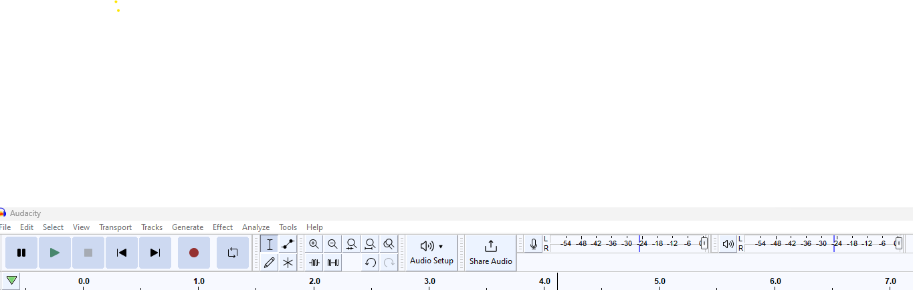
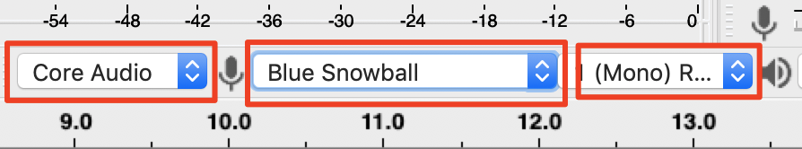
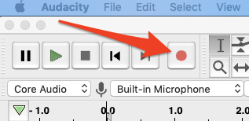

# Podcast Recording with Audacity
Once you’ve planned out your show, you can begin recording audio. Podcasts can be made with the simple set-up of a computer with a built-in microphone and access to the internet. But you will produce a much higher quality podcast if you use better recording equipment. One option is to record in the editing room, like the one located at Music & Media (M&M) in the library. Studios are generally well sound-proofed and have high-quality equipment that is already set up. To use the M&M podcast studio, contact a staff member at the M&M desk. 

Another option is to borrow equipment from the M&M desk. This is a good option if you want to record interviews at an event. Equipment is available on a first-come, first-serve basis for students. Faculty and staff need to ask permission from the M&M manager to borrow M&M equipment. Let’s record some audio for your podcast with Audacity. If you have any questions or get stuck as you work through this in-class exercise, please ask the instructor for assistance.  Have fun! 

NOTE: If you are participating in an online workshop, some find it difficult to participate in the video conference session and record audio in Audacity. If that is the case for you, please install Audacity, then practice recording audio as outlined in this activity, and use the optional audio file provided for you to edit in Activity #2. 

1. Equipment:
- If you are using your own laptop, [**download and install Audacity**](https://www.audacityteam.org/download/){:target="_blank"}. Make sure to select the correct version of Audacity for your laptop. Windows, Mac, or Linux.
- If possible use a **high-quality microphone** to record with rather than your laptop’s built-in microphone. You can borrow USB microphones from the UVic Libraries Music & Media desk. 
- It is often helpful to wear **over the ear headphones** when recording so that you can more easily hear any background noises that you do not want to be recorded.

2. Setting your computer to record from an external microphone (if you are using one):
- **Plug the USB microphone into your computer and turn it on before opening Audacity**. Audacity may not recognize the microphone unless you do this. If Audacity is already open, save your project, quit Audacity, turn on the microphone, and then re-open your project. 
- Before you begin to record you will have to change the settings in Audacity if you are going to use an external microphone. 
- **Windows Settings** to record from an external microphone:
      - Select the Switch Windows WASAPM to **MME** 
      - Change Speakers/ Headphones to **Microphone**. 
      - Change 2 (stereo) recording channel to **1 (mono) recording** channel.
      - Change to **Speakers**.
  

      <button onclick="toggle('gif1')">Show / Hide Animation </button>

      
      

 **Mac Settings** to record from an external microphone:
      - Make sure **Core Audio** is selected. 
      - Change Speakers/ Headphones to your **USB microphone** - not Built-in Microphone. 
      - Change 2 (stereo) recording channel to **1 (mono) recording** channel.

- If the USB microphone is not in the Audacity menu, confirm the device is turned on and plugged in, then Exit Audacity, restart Audacity and try again.

3. Record some test audio in Audacity in the location where you will be conducting your interview:
- **Find a quiet place** to record without interruptions or fan noise (especially overhead vents).
- **Wear headphones** if possible. Headphones help isolate the audio, helping you catch any problems in your narration or audio.
- **Place your microphone strategically**. The appropriate distance between your mouth and the microphone is 6 to 12 inches. This prevents "popping" noises and heavy breathing in your recording. If you sound thin and distant, get closer to the microphone.
- **Check your levels** by selecting the microphone icon on the top ribbon and the click on the “**Start Monitoring**” text. You should be wearing your headphones or earbuds to hear the audio.
     - Talk into your microphone and make sure your audio levels do not peak into the red as you talk. The optimal point for your microphone levels is just below the red. 
     - Stop talking for 10 or 20 seconds to determine if your recording spot has any background noise that would be disruptive to your podcast recording.
- **Speak clearly and articulate your words**. Remember to speak conversationally, as if speaking to a friend. Sit in a chair and sit up straight. Sound confident!
  
- **Record some test audio** by clicking on the red “**record**” button on the top navigation bar (see image on the right). After 20 to 30 seconds, press the square “**stop**” button. NOTE: clear and Ignore any popups that talk about slow hard drive speed. Here is an optional [Sample Podcast Script](sample-podcast-script.html) you can use for your recording if you’d like.

<button onclick="toggle('gif1')">Show / Hide Animation </button>

4. Review your audio:
- To listen to your recorded audio, **Click at the beginning** of the blue audio timeline and then press the **spacebar** on the computer to play and pause the audio.
- Determine if you are getting good quality video for both yourself, your co-host, and your interviewee. 
- If you are not getting good quality sound, please refer to **section 3 of this handout** and the **Podcasting Tips** handout for suggestions on how to improve audio quality.

5. Record your podcast audio:
- Once you are happy with the quality of your audio, you can now start your interview. In this workshop setting, there will be a lot of background noise -- which is not ideal, but for the purposes of this workshop, we want you to record between 2 and 5 minutes of audio for you to edit in the next step. Do your best and have fun being a podcast host!
- Next begin editing your test interview audio.

Great Job!

[NEXT STEP: Editing Audio in Audacity](editing-audio.html){: .btn .btn-blue }
