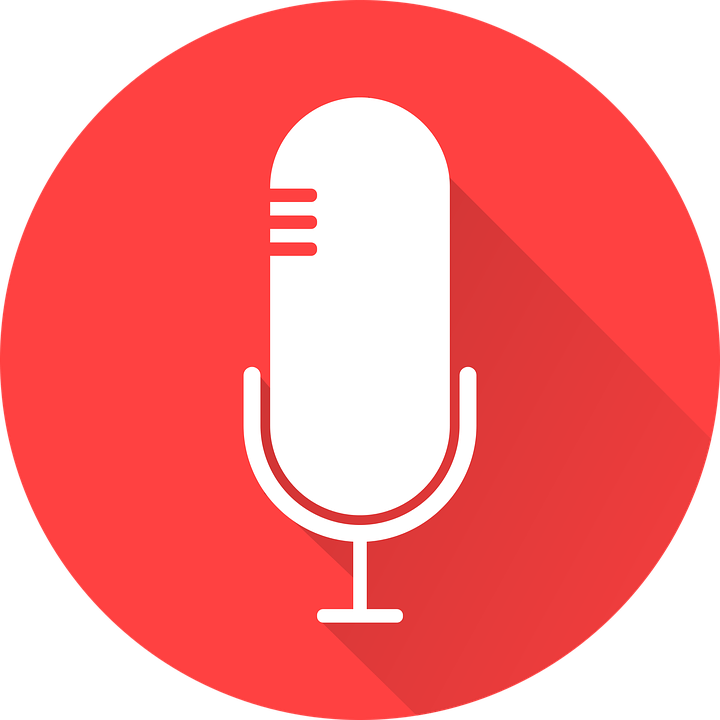
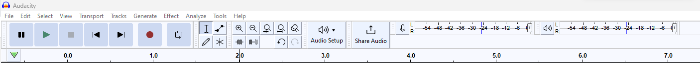
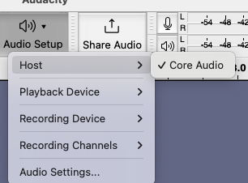
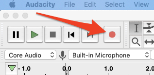

# Podcast recording with Audacity

## Introduction

Once you’ve planned out your show, you can begin recording audio. Podcasts can be made with the simple set-up of a computer with a built-in microphone and access to the internet. But, you will produce a higher quality podcast if you use better recording equipment and put a little work into your recording location. 

> **NOTE**: If you are participating remotely, some find it difficult to participate in the video conference session and record audio in Audacity. If that is the case for you, please install Audacity, then practice recording audio as outlined in the activities that follow. You can also use [this optional audio file](https://uviclibraries.github.io/podcasting/images/goat-girl.mp3), which is provided in the [Editing Audio](https://uviclibraries.github.io/podcasting/editing-audio.html) section of this workshop. 

## Getting things setup to record

Before we use Audacity to record, we need to consider a few things to make the process easier and to produce higher quality audio. 

### Location tips

- Find a quiet room. Typically, bedrooms and closets are good locations, as they already have features like beds and fabrics, which "baffle" sounds.
- Pick a room free from background noises—which are often sounds we do not usually notice in daily life. Modern microphones are sensitive, so they will pickup the buzz of a fridge, or outside traffic noise, or the hum of a fan running in a nearby room.
- Choose a smaller room with with minimal reflective surfaces, which can cause echos. One way to test for echos is to stand on the centre of your space and clap loudly. It might take a few claps to hear it, but rooms with a lot of flat surfaces will have a more sustained echo "flutter" than a smaller room with soft surfaces.
- The goal is not to eliminate all echos, as that will make the room sound acoustically "dead." Little changes can make big differences. For example, placing a soft rug under your chair and sitting next to some thick curtains could be enough to provide a balanced acoustic space. 

> **NOTE for UVic students, staff, and faculty:** UVic offers resources for podcasting and audio recording, including bookable media-creation rooms. The Mearns Centre for Learning, in the McPherson Library, has a [dedicated podcast room](https://www.uvic.ca/systems/labs/rooms-drop-ins/media-spaces/index.php#ipn-sound-video-production). UVic students can also use the [podcast corner](https://www.uvic.ca/systems/labs/rooms-drop-ins/find-space/labs/podcast-corner.php) in the Human & Social Development Building. In addition, the McPherson Library and HSD building have dedicated [sound and video rooms](https://www.uvic.ca/systems/labs/rooms-drop-ins/media-spaces/index.php#ipn-sound-video-production). Another option is to [borrow media equipment from the McPherson Library](https://www.uvic.ca/library/rooms-technology/laptops-equipment/index.php#ipn-equipment-details-mearns-mcpherson-library-) by going to the [Ask Us Desk](https://www.uvic.ca/library/visit-and-contact/mearns-mcpherson-library/index.php#ipn-ask-us-desk) on the main floor. 

If you haven't done so already, please download and install Audacity on your laptop. If you missed it, [step 1 of the Pre-Workshop Activities page](https://uviclibraries.github.io/podcasting/pre-workshop.html) has download links for Mac and Windows computers.  

Assuming that you have successfully installed Audacity, let’s take a look at some time-saving and recording-quality tips. After that, it will be time to do a test recording. 

If you have any questions or get stuck as you work through these in-class exercises, please ask the instructor for assistance. Have fun &#128512; 

### Equipment tips

- If possible use a **high-quality microphone** to record with rather than your laptop’s built-in microphone. 
- It is often helpful to wear **over the ear headphones** when recording, so that you can more easily hear any background noises that you do not want to be recorded.
- **Place your microphone strategically**. The appropriate distance between your mouth and the microphone is roughly 6 to 12 inches. This distance prevents "popping" noises and heavy breathing in your recording. If you sound thin and distant, get slightly closer to the microphone.
- **Speak clearly and articulate your words**, but try to speak conversationally, as if speaking to a friend. If you are sitting in a chair, try to sit up straight. Some people prefer to stand while recording, as this can help to give more energy to your voice.

Now that we have some basics in hand, let's move on to the recording process in Audacity. 

### Setting up the microphone

Getting your computer to record from an external microphone (if you are using one) takes a bit of setup. 

1. **Plug your USB microphone into your computer and turn it on _before_ opening Audacity**. Audacity may not recognize the microphone unless you do this. If Audacity is already open, save your project, quit Audacity, turn on the microphone, and then re-open your project. 
2. Change these Audacity settings:  
- **Windows settings** to record from an external microphone:
  - click on the **Audio Setup**, hover over **Host**, and select **MME**
  - click on the **Audio Setup**, hover over **Playback Device**, and select **Speakers (USB Condenser Mic)** 
  - click on the **Audio Setup**, hover over **Recording Device**, and select **Microphone (USB Condenser Mic)**
  - click on the **Audio Setup**, hover over **Recording Channels**, and select **1 (Mono) Recording Channel** 
  <!--  KSS note: this image needs an update? -->
  
      <button onclick="toggle('gif1')">Show / Hide Animation </button>

      
      

      
 **Mac Settings** to record from an external microphone:<b>
-  Under Audio set up: Make sure **Core Audio** is selected.
-  Change Speakers/ Headphones to your **USB microphone** - not Built-in Microphone, using your System Preferences and Sound settings (note you must re-launch Audacity after changing this setting.
-   Change 2 (stereo) recording channel to **1 (mono) recording** channel, under Audio Settings and Recording Channels.
-   The USB microphone is not in the Audacity menu, confirm the device is turned on and plugged in, then Exit Audacity, restart Audacity and try again. 

3. Record some test audio in Audacity in the location where you will be conducting your interview:

- **Check your levels** by selecting the microphone icon on the top ribbon and the click on the “**Start Monitoring**” text. You should be wearing your headphones or earbuds to hear the audio.
     - Talk into your microphone and make sure your audio levels do not peak into the red as you talk. The optimal point for your microphone levels is just below the red. 
     - Stop talking for 10 or 20 seconds to determine if your recording spot has any background noise that would be disruptive to your podcast recording.
  
- **Record some test audio** by clicking on the red “**record**” button on the top navigation bar (see image on the right). After 20 to 30 seconds, press the square “**stop**” button. NOTE: clear and Ignore any popups that talk about slow hard drive speed. Here is an optional [Sample Podcast Script](sample-podcast-script.html) you can use for your recording if you’d like.

     <button onclick="toggle('gif2')">Show / Hide Animation </button>

      
      

4. Review your audio:
- To listen to your recorded audio, **Click at the beginning** of the blue audio timeline and then press the **spacebar** on the computer to play or to pause the audio. 
- Determine if you are getting good quality video for both yourself, your co-host, and your interviewee. 
- If you are not getting good quality sound, please refer to **Planning and Tips** and the [Podcasting Tips](podcasting-tips.html){: .btn .btn-green } for suggestions on how to improve audio quality.

5. Record your podcast audio:
- Once you are happy with the quality of your audio, you can now start your interview. In this workshop setting, there will be a lot of background noise -- which is not ideal, but for the purposes of this workshop, we want you to record between 2 and 5 minutes of audio for you to edit in the next step. Do your best and have fun being a podcast host!
- Next begin editing your test interview audio.

Great Job!

[NEXT STEP: Editing Audio in Audacity](editing-audio.html){: .btn .btn-blue }
