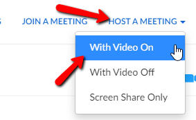
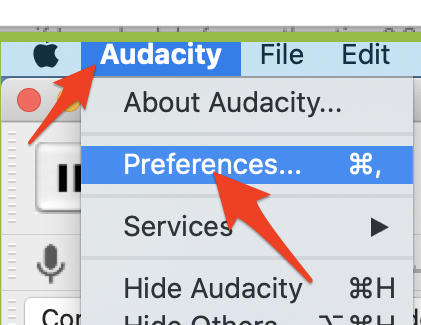
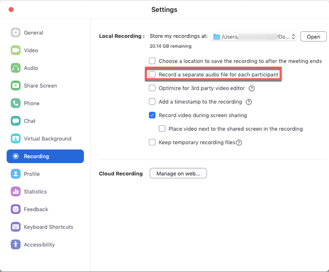

 

# Recording Remote Interviews using Zoom

Many podcasters use Zoom.us to record their sessions if the co-host or interviewee is not in the same location. Zoom gives you higher audio quality than you’ll get on a regular phone call, and it allows you to make calls with multiple people at once.

If you are doing this as an in-person workshop, please ask the instructor for assistance if you get stuck on any of the follwing steps.  

## Zoom free vs paid

Zoom saves some of its features for the paid versions, but with the free version, here are the relevant features and limits for audio recordings: 

- meetings are capped at 40 minutes in duration
- host up to 100 participants
- no cloud storage, so ensure that you have enough local (on your own computer) storage prior to recording

For most podcasters, the free verion of Zoom will suffice. You can work around the free versions's time limit by logging off after 40 minutes and restarting the meeting. But, if you need to assign co-hosts, or "break out rooms," then you will need the paid version.  

See the [Zoom.us pricing page](https://zoom.us/pricing) for more information on the different versions. 

To download Zoom, go to the [Zoom.us](https://uvic.zoom.us) website and click on the blue **Sign Up Free** button on the top right of the window.

>**NOTE** that **current UVic students and staff have access to the paid version of Zoom**. To access the paid version, you must **login using the "SSO" button**. From there, you will asked for yout **Netlink ID and password** to complete the login.  

## Setting up Zoom 
 

Once you have Zoom installed, you will need to get things setup. 

1. On the main Zoom.us webpage, click on the **HOST A MEETING** drop down box on the top right of the web page, and then select, **With Video On**.
>**NOTE**: If this is your first Zoom meeting, you will be prompted to **download** and **install** a small program. 
You will then be asked if you want to join a meeting. Press the **Cancel** button.
2. **Enter** the **email address** of the person you want to interview, and **press** the **I’m not a robot** checkbox, then **press** the orange **Invite** button. This will send an invite to your interviewee to join the Zoom meeting, which they will have to accept.

Once the interviewee has accepted the invite, and created a Zoom account (or logged on to their existing zoom account), you can then invite them to a “meeting,” where you can record your interview with them.

## Zoom settings for interviews
 

Before you begin your interview, you can walk through these steps to get things setup to record. 

**These steps assume that you have the Zoom application already installed**.  

1. On your computer, **open the Zoom app** and sign in.
2. **Click your profile picture**, then click **Settings**. Or, in Zoom versions 6.7.0 and higher, click on the gear icon at the bottom of the left menu (in the Zoom dashboard window). [stopped here]
3. Click the "Recording" tab on the left of the Settings window.
- Enable Record a separate audio file for each participant.

## Interviewing with Zoom
- On the main Zoom.us webpage, **click** on the **HOST A MEETING** drop down box on the top right of the web page, and then select, **With Video On**.
- A popup box will appear with the title **Open zoom.us**. **Click** on the Open **zoom.us** button. This launches the Zoom program on your computer with your laptop’s camera turned on.  
- **Click** on the **Invite** button at the bottom of the window, and then **click** on the **Copy URL** text on the bottom left of the screen.
- Message your interviewee either by email or instant message and **paste** in the **URL** you just copied which will look something like this: https://zoom.us/j/532670881?pwd=Yyt3ZVZjQ2VFdzBCd21wN2s2QUVGUT09. When your interviewee clicks on the link it will ask them if they would like to join your meeting.
  
- Once they have joined your meeting, let them know that you are going to start recording, and then **click** on the **Record** button on the bottom right of the Zoom window.
- If you haven’t already, **put on some headphones** so that you can make sure that the audio levels from your end and your interviewees end sound good. 
- You may need to adjust your audio input settings, and you may need to walk your participant through how to do the same. It can be helpful to ask your interviewee to share their screen with you in order to adjust their audio levels.
      - Windows: **Windows Settings -> System -> Sound -> Input**.
      - OSX: **System Preferences -> Sound -> Input -> Input Volume**.
- Once everything sounds good, start your interview proper and officially welcome your guest. 
- You can always edit out the introduction where you are getting everything set up, but you never know, you might record something interesting with your interviewee while taking care of pre-podcast technical details.

6. Ending the interview & importing the interview audio into Audacity:  
- To end the recording of the interview **mouse over** the **Recording** text on the top left of the Zoom screen (see right) and then **press** the white square **stop icon**.
- End the meeting by **pressing** the red **End Meeting** text at the bottom right of the Zoom screen (you may need to move your mouse to the Zoom screen to see the text).
- A dialogue box will appear. **Press** the **End Meeting for All** button.
- Another dialogue box will appear asking you where you want Zoom to save the recordings from the meeting on your local hard drive. **Select a location** where you will be able to easily find the files and **press** the **Save** button.
- A folder with the location you selected should now appear.
- **Open Audacity. Drag and drop** the **m4a** file in the folder that Zoom opened for you **into Audacity**. If you get an error message you will need to install the ffmpeg driver that will allow you to import this file into Audacity.
- Note: If you are using a Mac please follow these additional instructions for[Importing or exporting audio using FFmpeg instructions](https://support.audacityteam.org/basics/installing-ffmpeg){:target="_blank"}
- Now you’re ready to edit the interview! 

Great Job and Happy interviewing! 

[NEXT STEP: Publishing Single Audio Interviews](publishing-single-audio-interviews.html){: .btn .btn-blue }
